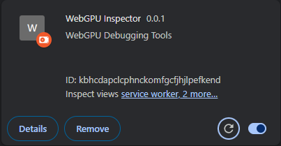

# WebGPU Inspector 

Inspection debugger for WebGPU.

## Installation

**WebGPU Inspector is still in active development and not yet published on the Chrome Extension Store. You'll need to install it manually from source for now.**
- Download project from Github.
  - git clone https://github.com/brendan-duncan/webgpu_inspector
- In Chrome, open **chrome://extensions**
- Enable Developer Mode (switch in top-right corner)
- Press **Load Unpacked** button
- Browse to **<webgpu_inspector directory>/extensions** and press **Select Folder**
- Make sure the extension is enabled.

## [Documentation](docs/overview.md)

## Usage

The WebGPU Inspector extension is available from the Developer Tools window.

From a page that has WebGPU content, press **F12** to open the Chrome Developer Tools window. When the WebGPU Inspector extension is enabled in the extension manager, there will be a **WebGPU Inspector** tab.

## Development

Building the project requires an installation of [Node.js](https://nodejs.org/en/).

- Make sure the dependencies are installed: `npm install`
- Compile the project: `npm run build`.
- Compile on file changes: `npm run watch`.
- To use source maps, edit `rollup.config.js` and change `sourcemap: false` to `sourcemap: true`.

After the project is built:

- If you have the DevTools open, right-click on the WebGPU Inspector DevTools panel, select `Reload frame`.