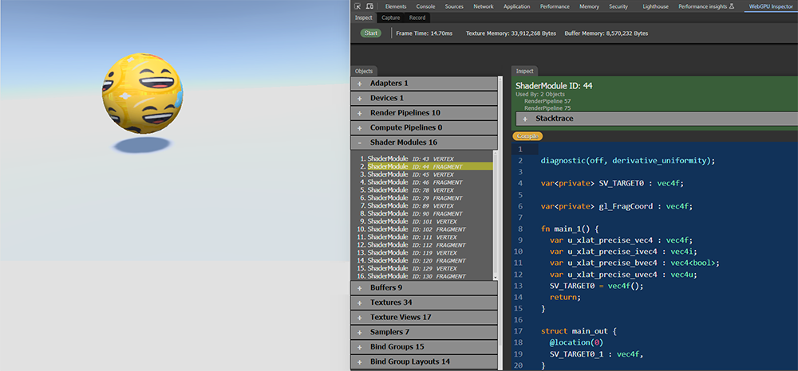

# WebGPU Inspector Debugging Tool

**Version: 0.0.5**

Inspection and graphics debugging browser extension tool for WebGPU.

## Installation

### Chrome Web Store

**WebGPU Inspector is still in active development, expect many frequent changes and the published version will lag behind the source version.**

Install WebGPU Inspector from the [Chrome Web Store](https://chromewebstore.google.com/detail/webgpu-inspector/holcbbnljhkpkjkhgkagjkhhpeochfal).

### From Source

To get the most up to date version of WebGPU Inspector, you can install the extension from source.

- Download project from Github.
  - git clone https://github.com/brendan-duncan/webgpu_inspector

Crome and Firefox don't support the same version of extension plug-ins, so you'll need to load the correct version.

#### Chrome
- Open **chrome://extensions**
- Enable Developer Mode (switch in top-right corner)
- Press **Load Unpacked** button
- Browse to **<webgpu_inspector directory>/extensions/chrome** and press **Select Folder**

#### Edge
- Open **edge://extensions**
- Enable Developer Mode (switch on left side of page)
- Press **Load Unpacked** button
- Browse to **<webgpu_inspector directory>/extensions/chrome** and press **Select Folder**

#### Firefox Nightly
- [Firefox Nightly](https://www.mozilla.org/en-US/firefox/channel/desktop/) has work-in-progress WebGPU support, which you can enable from **Settings / Nightly Experiments / Web API: WebGPU**
- Open **about:debugging**
- Select **This Nightly** from the left side of the page, depending on which version of Firefox you're using.
  - Only **Firefox Nightly** has WebGPU support, currently.
- Press **Load Temporary Add-On**.
- Browse to **<webgpu_inspector directory>/extensions/firefox**, select **manifest.json** and press **Open**.
- **Temporary Add-On's will need to be re-loaded every time you start Firefox.**

#### Safari Technology Preview
- [Safari Technology Preview](https://developer.apple.com/safari/technology-preview/) has WebGPU support, which you can enable from **Develop / Feature Flags... / WebGPU**.
- Safari Extension development is done through Xcode
- Open **<webgpu_inspector directory>/extensions/safari/WebGPU_Inspector.xcodeproj** with Xcode
  - Switch the Scheme to **WebGPU Inspector (macOS)**
  - Select **Product / Run**
- From Safari Technology Preview
  - Select **Develop / Developer Settings...**
  - Enable **Allow unsigned extensions**
  - Select the **Extensions** tab in Settings, and make sure WebGPU Inspector is listed as an extension
  - WebGPU Inspector should be a tab in the Web Inspector window (**Develop / Show Web Inspector** or right-click on page and select **Inspect element**)
- If you make changes to the WebGPU Inspector source
  - From Xcode, select **Product / Build** (**cmd-b**)
- **Note**:
  - Safari support is still a work-in-progress and has issues

## [Documentation](docs/overview.md)

## Usage

The WebGPU Inspector extension is available from the Developer Tools window.

From a page that has WebGPU content, press **F12** to open the Chrome Developer Tools window. When the WebGPU Inspector extension is enabled in the extension manager, there will be a **WebGPU Inspector** tab.

The **WebGPU Inspector** tab contains several tools: [Inspect](docs/inspect.md), [Capture](docs/capture.md), and [Record](docs/record.md).

## Development

Building the project requires an installation of [Node.js](https://nodejs.org/en/).

- Make sure the dependencies are installed: `npm install`
- Compile the project: `npm run build`.
- Compile on file changes: `npm run watch`.
- Sometimes the terser minimizer can make source map debugging problematic. To simplify debugging, edit **rollup.config.js** and comment out the terser entry in plugins.

After the project is built:

- If you have the DevTools open, right-click on the WebGPU Inspector DevTools panel, select `Reload frame`.
