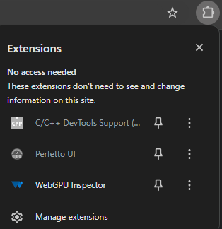

# WebGPU Inspector

Inspection debugger for WebGPU

## Installation

- Download project from Github.
- In Chrome, open **chrome://extensions**
- Enable Developer Mode (switch in top-right corner)
- Press **Load Unpacked** button
- Browse to **<webgpu_inspector directory>/extensions** and press **Select Folder**

## Usage

- On the page to inspect, press the puzzle piece icon on the address bar, and select **WebGPU Inspector**.
  - You can press the pin icon to add it to the Chrome URL bar.

Clicking on the WebGPU Inspector extension will open the WebGPU Inspector side-bar panel.

