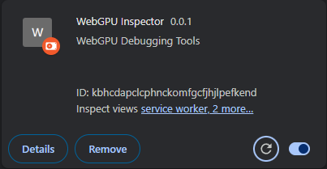
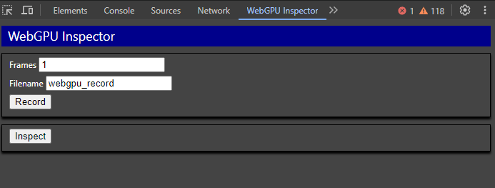
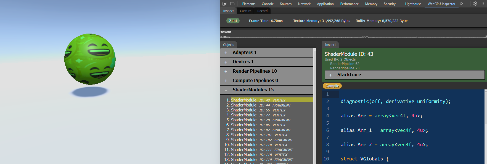
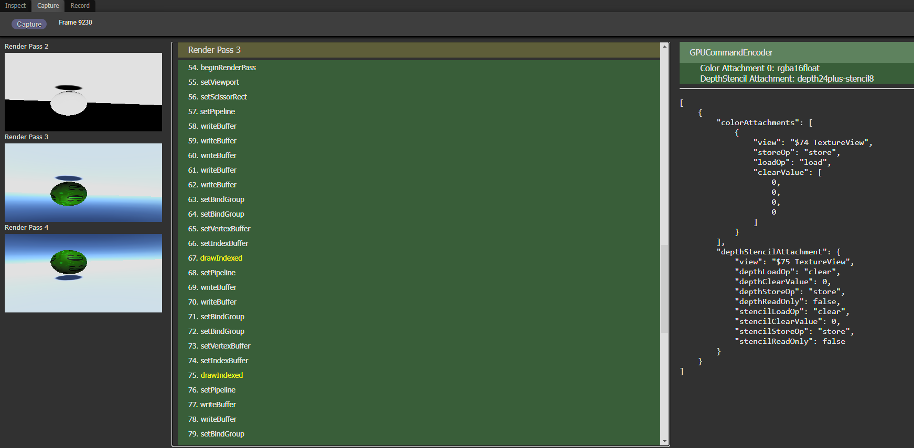
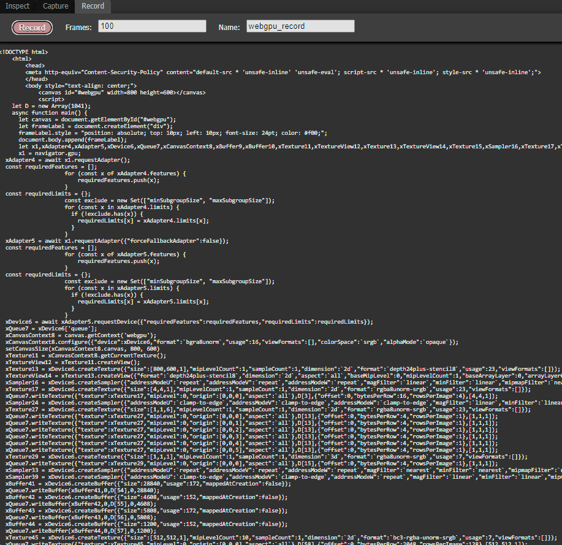

# WebGPU Inspector

Inspection debugger for WebGPU

## Installation

- Download project from Github.
- In Chrome, open **chrome://extensions**
- Enable Developer Mode (switch in top-right corner)
- Press **Load Unpacked** button
- Browse to **<webgpu_inspector directory>/extensions** and press **Select Folder**
- Make sure the extension is enabled

## Usage

The WebGPU Inspector extension is available from the Developer Tools window.

From a page that has WebGPU content, press **F12** to open the Chrome Developer Tools window. When the WebGPU Inspector extension is enabled in the extension manager, there will be a **WebGPU Inspector** tab.

## Tools

### Inspect

The Inspector tool will reload the page and inject the WebGPU Inspector into it, reporting information about the state of WebGPU to the tool.

Press the Start button to inject the Inspector tool and reload the page.

----

### Capture

Capture all WebGPU commands used to render a frame.

If the Inspector hadn't been already started on the page, it will be started and the page will reload, capturing the first frame results.

If the Inspector is already running, it will capture the next frame.

----

### Record

The Recorder tool will reload the page and inject the WebGPU Recorder into it. This will record all WebGPU commands and data for the given number of **Frames** and then download it to a file called **Filename**.html.

**Frames** is the number of frames to capture.
**Name** is the name of the HTML file that will be downloaded, as __name__.html.

Press the **Record** button to inject the recorder tool into the page and reload the page. Recording always starts from the loading of the page.

When the recording has finished, it will be automatically downloaded by the browser, and presented on the Record panel.

