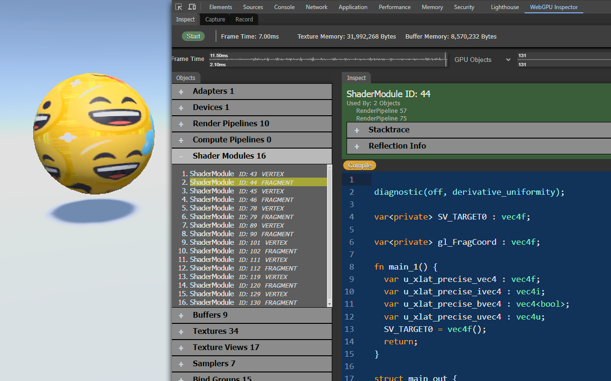
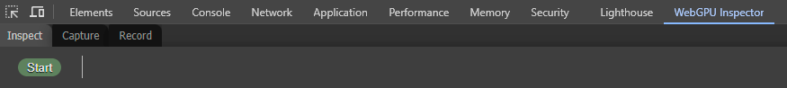

# WebGPU Inspector

[Inspect](docs/inspect.md) . [Capture](docs/capture.md) . [Record](docs/record.md)

* [Introduction](#introduction)
* [Developer Tools Window](#developer-tools-window)
  * [Extension Problem Solving](#problem-solving)
* [Installation](#installation)
  * [Chrome Web Store](#chrome-web-store)
  * [From Source](#from-source)
    * [Chrome](#chrome)
    * [Firefox](#firefox-nightly)
    * [Safari](#safari-technology-preview)
* [Development](#development)

## Introduction

**Version: 0.9.0**

Inspection, profiling, and graphics debugging browser extension for WebGPU.

WebGPU Inspector is designed to inspect what's happening with WebGPU on the page, independent of the engine.

WebGPU Inspector includes the following tools:

* **[Inspect](docs/inspect.md)** records all GPU objects live on the page, letting you inspect their details.
* **[Capture](docs/capture.md)** records the GPU commands used to render a frame, letting you inspect details about each command.
* **[Record](docs/record.md)** records all GPU commands and data used to render a set of frames, generating a self-contained HTML file that can play back the render, or be used for bug reports.

WebGPU Inspector provides the following capabilities:
* A live view of all GPU objects and inspect their details.
* Capture all GPU commands used to render a frame, along with render pass output images, textures, buffer data, render state.
* Edit shaders live on the page.
* Inspect storage and uniform buffers used for draw and dispatch calls.
* Inspect textures, including pixel values.
* Plot frame times and object allocations over time.
* Record all commands and data for a set of frames for playback or bug reports.

### Developer Tools window
Select __More Tools / Developer Tools__, or press __F12__ or __Shit+CTRL+J__ (__Option + ⌘ + J__ on MacOS). You can also right-click on the page and select __Inspect__. When the WebGPU Inspector extension is enabled in the extension manager, there will be a **WebGPU Inspector** tab.

### Extension Problem Solving

##### [Back to top](#webgpu-inspector)

#### WebGPU Inspector panel missing from Developer Tools

If the WebGPU Inspector tab is not present on the Developer Tools panel, try closing the Developer Tools window and opening it again. Sometimes the browser doesn't load the extension.

#### Inspect Start, Capture, or Record does not work

Sometimes the browser extension script does not get injected into the page properly. Refresh the page and WebGPU Inspector should start working.

#### Inspect is running but Capture does not work

Some pages will not update if they do not have focus. If Capture is not recording anything, try selecting the page to make sure it has focus.

## Installation

##### [Back to top](#webgpu-inspector)

### Chrome Web Store

Install WebGPU Inspector from the [Chrome Web Store](https://chromewebstore.google.com/detail/webgpu-inspector/holcbbnljhkpkjkhgkagjkhhpeochfal).

### From Source

##### [Back to top](#webgpu-inspector)

To get the most up to date version of WebGPU Inspector, you can install the extension from source.

- Download project from Github.
  - git clone https://github.com/brendan-duncan/webgpu_inspector

Crome and Firefox don't support the same version of extension plug-ins, so you'll need to load the correct version.

#### Chrome
- Open **chrome://extensions**
- Enable Developer Mode (switch in top-right corner)
- Press **Load Unpacked** button
- Browse to **<webgpu_inspector directory>/extensions/chrome** and press **Select Folder**

#### Edge
- Open **edge://extensions**
- Enable Developer Mode (switch on left side of page)
- Press **Load Unpacked** button
- Browse to **<webgpu_inspector directory>/extensions/chrome** and press **Select Folder**

#### Firefox Nightly
- [Firefox Nightly](https://www.mozilla.org/en-US/firefox/channel/desktop/) has work-in-progress WebGPU support, which you can enable from **Settings / Nightly Experiments / Web API: WebGPU**
- Open **about:debugging**
- Select **This Nightly** from the left side of the page, depending on which version of Firefox you're using.
  - Only **Firefox Nightly** has WebGPU support, currently.
- Press **Load Temporary Add-On**.
- Browse to **<webgpu_inspector directory>/extensions/firefox**, select **manifest.json** and press **Open**.
- **Temporary Add-On's will need to be re-loaded every time you start Firefox.**

#### Safari Technology Preview
- **Note**:
  - Safari support is still a work-in-progress and has issues
- [Safari Technology Preview](https://developer.apple.com/safari/technology-preview/) has WebGPU support, which you can enable from **Develop / Feature Flags... / WebGPU**.
- Safari Extension development is done through Xcode
- Open **<webgpu_inspector directory>/extensions/safari/WebGPU_Inspector.xcodeproj** with Xcode
  - Switch the Scheme to **WebGPU Inspector (macOS)**
  - Select **Product / Run**
- From Safari Technology Preview
  - Select **Develop / Developer Settings...**
  - Enable **Allow unsigned extensions**
  - Select the **Extensions** tab in Settings, and make sure WebGPU Inspector is listed as an extension
  - WebGPU Inspector should be a tab in the Web Inspector window (**Develop / Show Web Inspector** or right-click on page and select **Inspect element**)
- If you make changes to the WebGPU Inspector source
  - From Xcode, select **Product / Build** (**cmd-b**)

## Development

##### [Back to top](#webgpu-inspector)

Building the project requires an installation of [Node.js](https://nodejs.org/en/).

- Make sure the dependencies are installed: `npm install`
- Compile the project: `npm run build`.
- Compile on file changes: `npm run watch`.

After the project is built:

- If you have the DevTools open, right-click on the WebGPU Inspector DevTools panel, select `Reload frame`.
- Some changes require a full reload. Open **chrome://extensions**, press the refresh button for the WebGPU Inspector extension. With DevTools open for the page, right-click on the refresh button for the page and select "Empty Cache and Hard Reload". Then right-click on the WebGPU Inspector DevTools panel and select "Reload frame". This will make sure Chrome's cache has been fully cleared.

**Notes** 
- Sometimes the terser minimizer can make source map debugging problematic. To simplify debugging, edit **rollup.config.js** and comment out the terser entry in plugins.

## External Dependencies

##### [Back to top](#webgpu-inspector)

* [WGSL Reflect](https://github.com/brendan-duncan/wgsl_reflect)
  * Used for parsing and getting reflection information from WGSL shaders.
* [WebGPU Recorder](https://github.com/brendan-duncan/webgpu_recorder)
  * Used for generating recordings of WebGPU content.

