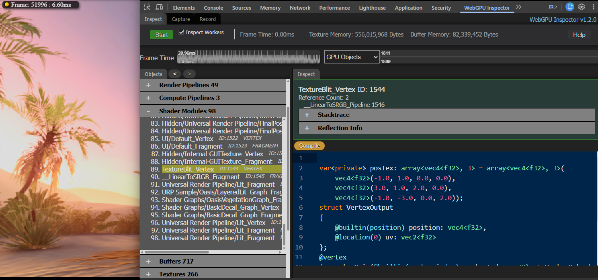
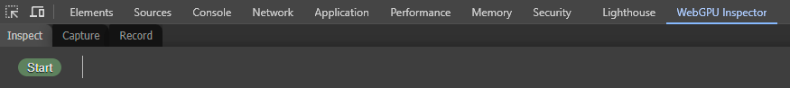

# WebGPU Inspector

[Inspect](docs/inspect.md) . [Capture](docs/capture.md) . [Record](docs/record.md)

* [Introduction](#introduction)
* [Developer Tools Window](#developer-tools-window)
  * [Extension Problem Solving](#extension-problem-solving)
* [Installation](#installation)
  * [Chrome Web Store](#chrome-web-store)
  * [Firefox Add-Ons Store](#firefox-add-ons-store)
  * [Manual Injection](#manual-injection)
  * [Building From Source](#building-from-source)
    * [Chrome](#chrome)
    * [Edge](#edge)
    * [Firefox](#firefox-nightly)
    * [Safari](#safari-technology-preview)
* [Claude Code Integration](#claude-code-integration)
  * [Install the Plugin](#install-the-plugin)
  * [Update the Plugin](#update-the-plugin)
* [Development](#development)
* [External Dependencies](#external-dependencies)

## Introduction

Inspection, profiling, and graphics debugging browser extension for WebGPU.

WebGPU Inspector is designed to inspect what's happening with WebGPU on the page, independent of the engine.

WebGPU Inspector includes three tools:

* **[Inspect](docs/inspect.md)** — a live view of every GPU object on the page. Inspect their details, plot frame times and object allocations over time, inspect textures (including pixel values), and [edit](docs/inspect.md#editing-shaders) and [debug](docs/shader_debugger.md) shaders live on the page.
* **[Capture](docs/capture.md)** — records the GPU commands used to render a frame, with render pass output images, textures, buffer data, and render state, letting you inspect details about each command, including the storage and uniform buffers used for draw and dispatch calls.
* **[Record](docs/record.md)** — records all GPU commands and data used to render a set of frames, generating a self-contained HTML file (or compact binary) that can play back the render or be used for bug reports.

<a href="docs/images/webgpu_inspector_screen.png">

</a>

### Developer Tools Window
Select __More Tools / Developer Tools__, or press __F12__ or __Shift+CTRL+J__ (__Option + ⌘ + J__ on MacOS). You can also right-click on the page and select __Inspect__. When the WebGPU Inspector extension is enabled in the extension manager, there will be a **WebGPU Inspector** tab.



### Extension Problem Solving

##### [Back to top](#webgpu-inspector)

#### WebGPU Inspector panel missing from Developer Tools

If the WebGPU Inspector tab is not present on the Developer Tools panel, try closing the Developer Tools window and opening it again. Sometimes the browser doesn't load the extension.

#### Inspect Start, Capture, or Record does not work

Sometimes the browser extension script does not get injected into the page properly. Refresh the page and WebGPU Inspector should start working.

#### Inspect is running but Capture does not work

Some pages will not update if they do not have focus. If Capture is not recording anything, try selecting the page to make sure it has focus.


## Installation

##### [Back to top](#webgpu-inspector)

### Chrome Web Store

Install WebGPU Inspector from the [Chrome Web Store](https://chromewebstore.google.com/detail/webgpu-inspector/holcbbnljhkpkjkhgkagjkhhpeochfal).

### Firefox Add-Ons Store

Install WebGPU Inspector from the [Firefox Add-Ons Store](https://addons.mozilla.org/en-US/firefox/addon/webgpu-inspector).

## Claude Code Integration

##### [Back to top](#webgpu-inspector)

WebGPU Inspector can be integrated with [Claude Code](https://claude.com/claude-code) as a plugin that brings WebGPU frame capture and analysis into a conversation with Claude.

Claude can launch (or attach to) a browser, instrument any page — with no
browser extension and no changes to the page being analyzed — capture one or
more frames, and then analyze the result: command and draw-call counts, the GPU
object graph, shaders, validation errors, and common performance problems. It
builds on the [Local Capture API](docs/manual_injection.md#local-capture-api) and produces the same
capture JSON the DevTools Capture panel reads.

The plugin lives in [claude-plugin/](claude-plugin/) — see
[claude-plugin/README.md](claude-plugin/README.md) for full usage, the MCP tool
list, and configuration. It installs straight from this repository, which
doubles as a Claude Code plugin marketplace; the bridge server's dependencies
are vendored, so there is no `npm install` step. Requires Node.js 18+ and a
local Chrome or Edge install.

### Install the Plugin

From any terminal, add this repo as a marketplace and install the plugin:

```sh
claude plugin marketplace add brendan-duncan/webgpu_inspector
claude plugin install webgpu-inspector@webgpu-inspector-plugins
```

`webgpu-inspector` is the plugin name; `webgpu-inspector-plugins` is the
marketplace name. The same steps work from inside Claude Code with
`/plugin marketplace add brendan-duncan/webgpu_inspector` then
`/plugin install webgpu-inspector@webgpu-inspector-plugins` (terminal CLI), or
the `/plugins` dialog in the VS Code / JetBrains extension. Claude Code starts
the bundled MCP server automatically once the plugin is enabled.

### Update the Plugin

Updates are **not** automatic by default. When a new version is released, pull
it in two steps — refresh the marketplace catalog, then update the plugin:

```sh
claude plugin marketplace update webgpu-inspector-plugins
claude plugin update webgpu-inspector@webgpu-inspector-plugins
```

Then run `/reload-plugins` (or restart) to load it. To get updates
automatically, open `/plugin` (terminal CLI) or `/plugins` (extension), go to
the **Marketplaces** tab, select `webgpu-inspector-plugins`, and enable
**auto-update**. Check your installed version with `claude plugin list`.

#### Automatic Updates

Auto-updating has to be enabled manually for plugins installed this way.
Edit **~/.claud/settings.json**
Look for **"webgpu-inspector-plugins"**
add **"autoUpdates": true**
after the "source" block,

```json
"webgpu-inspector-plugins": {
  "source": {
    "source": "github",
    "repo": "brendan-duncan/webgpu_inspector"
  },
  "autoUpdate": true
}
```

You can check your installed version anytime with `claude plugin list`.

### Manual Injection

##### [Back to top](#webgpu-inspector)

If the WebGPU Inspector's automatic injection isn't working to inspect the page (workers inside of iframes cause trouble), you can include `webgpu_inspector.js` directly in a page.

Add the script tag to your page **before** any code that uses WebGPU, so the inspector can patch the WebGPU API before it's used:

```html
<script src="https://cdn.jsdelivr.net/gh/brendan-duncan/webgpu_inspector@main/extensions/chrome/webgpu_inspector.js"></script>
```

To pin to a specific release instead of tracking `main`, replace `@main` with a version tag (e.g. `@1.2.0`).

When loaded this way, the script wraps the page's WebGPU API and exposes the inspector instance as `webgpuInspector` on the global (`window.webgpuInspector` in a page, `self.webgpuInspector` in a worker).

Once the inspector is loaded, you have two ways to view what it records:

1. Open the WebGPU Inspector DevTools panel from the browser extension. The DevTools panel must be open when the page is loaded (refreshing the page may be necessary) in order to receive all of the WebGPU data from the beginning of the page's execution.
2. Drive capture from the page itself with the **Local Capture API** — no DevTools panel required.

See the **[Manual Injection guide](docs/manual_injection.md)** for the page-side Local Capture API, loading the script from JavaScript / TypeScript, Web Worker setup, and TypeScript type declarations.

### Building From Source

##### [Back to top](#webgpu-inspector)

To get the most up to date version of WebGPU Inspector, you can install the extension from source.

- Download project from Github.
  - git clone https://github.com/brendan-duncan/webgpu_inspector

Chrome and Firefox don't support the same version of extension plug-ins, so you'll need to load the correct version.

#### Chrome
- Open **chrome://extensions**
- Enable Developer Mode (switch in top-right corner)
- Press **Load Unpacked** button
- Browse to **<webgpu_inspector directory>/extensions/chrome** and press **Select Folder**

#### Edge
- Open **edge://extensions**
- Enable Developer Mode (switch on left side of page)
- Press **Load Unpacked** button
- Browse to **<webgpu_inspector directory>/extensions/chrome** and press **Select Folder**

#### Firefox Nightly
- [Firefox Nightly](https://www.mozilla.org/en-US/firefox/channel/desktop/) has work-in-progress WebGPU support, which you can enable from **Settings / Nightly Experiments / Web API: WebGPU**
- Open **about:debugging**
- Select **This Nightly** from the left side of the page, depending on which version of Firefox you're using.
  - Only **Firefox Nightly** has WebGPU support, currently.
- Press **Load Temporary Add-On**.
- Browse to **<webgpu_inspector directory>/extensions/firefox**, select **manifest.json** and press **Open**.
- **Temporary Add-Ons will need to be re-loaded every time you start Firefox.**

#### Safari Technology Preview
- **Note**:
  - Safari support is still a work-in-progress and has issues
- [Safari Technology Preview](https://developer.apple.com/safari/technology-preview/) has WebGPU support, which you can enable from **Develop / Feature Flags... / WebGPU**.
- Safari Extension development is done through Xcode
- Open **<webgpu_inspector directory>/extensions/safari/WebGPU_Inspector.xcodeproj** with Xcode
  - Switch the Scheme to **WebGPU Inspector (macOS)**
  - Select **Product / Run**
- From Safari Technology Preview
  - Select **Develop / Developer Settings...**
  - Enable **Allow unsigned extensions**
  - Select the **Extensions** tab in Settings, and make sure WebGPU Inspector is listed as an extension
  - WebGPU Inspector should be a tab in the Web Inspector window (**Develop / Show Web Inspector** or right-click on page and select **Inspect element**)
- If you make changes to the WebGPU Inspector source
  - From Xcode, select **Product / Build** (**cmd-b**)

## Development

##### [Back to top](#webgpu-inspector)

Building the project requires an installation of [Node.js](https://nodejs.org/en/).

- Make sure the dependencies are installed: `npm install`
- Compile the project: `npm run build`.
- Compile on file changes: `npm run watch`.

Update the plugin version from rollup.config.js.

After the project is built:

- If you have the DevTools open, right-click on the WebGPU Inspector DevTools panel, select `Reload frame`.
- Some changes require a full reload. Open **chrome://extensions**, press the refresh button for the WebGPU Inspector extension. With DevTools open for the page, right-click on the refresh button for the page and select "Empty Cache and Hard Reload". Then right-click on the WebGPU Inspector DevTools panel and select "Reload frame". This will make sure Chrome's cache has been fully cleared.

**Notes** 
- Sometimes the terser minimizer can make source map debugging problematic. To simplify debugging, edit **rollup.config.js** and comment out the terser entry in plugins.

## External Dependencies

##### [Back to top](#webgpu-inspector)

* [WGSL Reflect](https://github.com/brendan-duncan/wgsl_reflect)
  * Used for parsing and getting reflection information from WGSL shaders.
* [WebGPU Recorder](https://github.com/brendan-duncan/webgpu_recorder)
  * Used for generating recordings of WebGPU content.


