# Capture
[Overview](../README.md) . [Inspect](inspect.md) . [Record](record.md)

* [Introduction](#introduction)
* [Capturing Frame Data](#capturing-frame-data)
* [Saving and Loading Captures](#saving-and-loading-captures)
* [Reopening a Capture in a New Tab or Window](#reopening-a-capture-in-a-new-tab-or-window)
* [Frame Commands](#frame-commands)
* [Render Pass Textures](#render-pass-textures)
* [Command Stacktrace](#command-stacktrace)
* [Command Inspection](#command-inspection)
* [Uniform and Storage Buffer Inspection](#uniform-and-storage-buffer-inspection)
    * [Formatting Buffer Data](formatting_buffer_data.md)
* [Vertex Buffer Data](#vertex-buffer-data)
* [Debug Groups](#debug-groups)
* [Frame Stats](#frame-stats)
* [Shader Debugger](#shader-debugger)

## Introduction
###### [Back to top](#capture)

Capture all rendering commands used to render a frame, letting you inspect each command, as well as providing information about the rendering state at each command. It also captures the image results of each render pass.

<a href="images/capture.png">
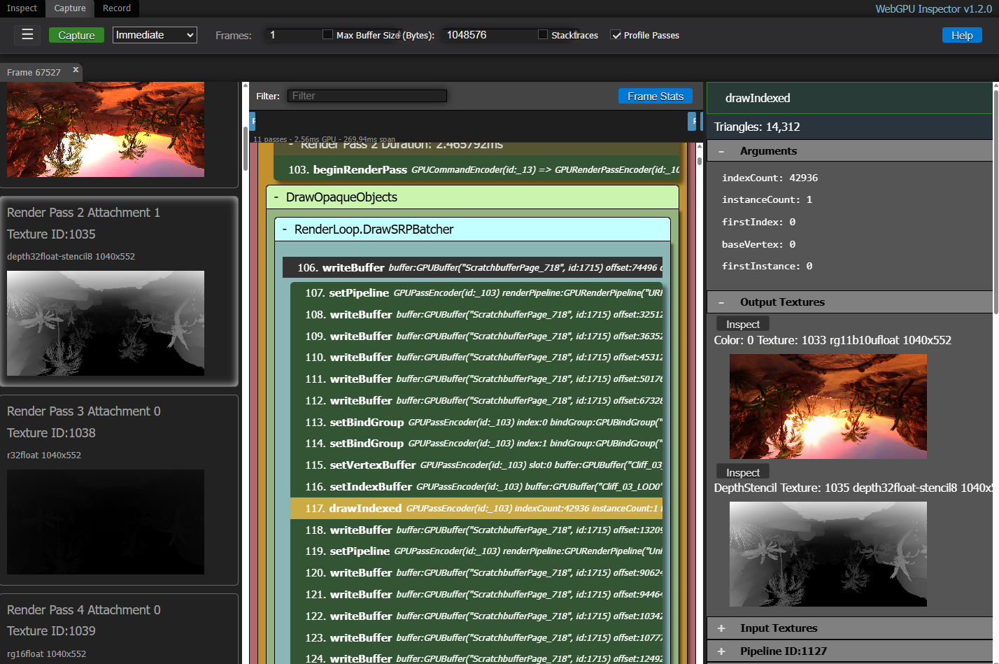
</a>

## Capturing Frame Data
###### [Back to top](#capture)

Press the **Capture** button to capture a frame from the page.

### Capture Mode

Capture has two modes: **Immediate** and **Specific Frame**.

#### Immediate Capture

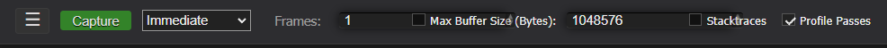

Immediate capture will record the current frame on the page.

**Frames** indicates how many frames to capture.

#### Specific Frame Capture

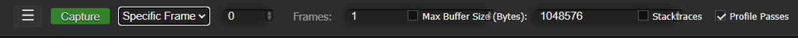

Specific frame capture will record a specific frame from the load of the page. Using this capture mode will cause the page to refresh, and start recording at the indicated frame.

A start frame of **0** will record all commands from the start of the page load, including those outside of a requestAnimationFrame frame. This allows you to capture commands for pages that do not use requestAnimationFrame.

**Frames** indicates how many frames to capture once it has started recording.

For pages that do not use requestAnimationFrame, the Frames value does not do anything. In that case, recording will continue until the GPU device has been destroyed or garbage collected, or you press the inspector overlay on the page to stop the recording.

#### Max Buffer Size

The **Max Buffer Size** value specifies the maximum buffer size Capture will record, for Uniform and Storage buffers. Sending buffer data to the DevTools panel can be slow, so limiting the buffer size can help capture performance. Large buffers are typically used for storage buffers.

#### Stacktraces

The **Stacktraces** checkbox controls whether a stacktrace is recorded for each captured command. It is **off by default**, because recording a stacktrace per command can significantly increase the size of a capture for frames with many commands. Enable it when you need to know where in the page's code a command was issued. See [Command Stacktrace](#command-stacktrace).

#### Profile Passes

The **Profile Passes** checkbox injects GPU timestamp queries around each render and compute pass so the capture can report per-pass GPU duration. It is **on by default**.

This requires the page's adapter to support the `timestamp-query` feature. If the adapter doesn't grant it, the injection is silently skipped and no timing data is produced.

When timing data is available, it is presented in three places:

* A **GPU pass timeline** at the top of the frame's command list, showing each render/compute pass as a bar sized to the fraction of the frame it took.
* Each pass header in the command list is annotated with its `Duration:<N>ms`.
* The [Frame Stats](#frame-stats) panel includes a **Pass Timings** breakdown.

Because the timing data travels with the capture, the timeline and pass timings also appear for [saved/loaded](#saving-and-loading-captures) captures.

#### Note

Frame capture works best when requestAnimationFrame is used, as Capture uses that to identify what commands to capture for a frame. Immediate capture will not work without requestAnimationFrame. In that case, use **Specific Frame** capture with frame 0, to start recording after page load.

## Saving and Loading Captures
###### [Back to top](#capture)

Captures can be saved to disk as a JSON file and re-opened later in the panel. This is useful for sharing a frame capture in bug reports, comparing captures from different builds, or returning to a capture after closing the DevTools.

The Save / Load actions live in the hamburger (**☰**) menu on the left side of the Capture panel's toolbar, next to the **Capture** button.

### Save Capture

**Save Capture** is enabled whenever a capture tab is active. Selecting it downloads the active tab as a `webgpu_capture_frame_<N>.json` file, where `<N>` is the captured frame index.

The JSON file contains everything the panel needs to fully reconstruct the capture:

* The full GPU object graph (adapters, devices, buffers, textures, texture views, samplers, bind groups, bind group layouts, pipeline layouts, render and compute pipelines, render bundles, shader modules) with their descriptors and stacktraces.
* The recorded command list for the frame, with arguments, results, and captured stacktraces.
* The image data for each render pass color/depth attachment that was read back during capture, stored as base64-encoded mip data on the corresponding Texture record.
* The buffer data captured for `setVertexBuffer`, `setIndexBuffer`, indirect draws/dispatches, and any Uniform / Storage buffer bound for inspection, attached to the command record it belongs to.
* Validation errors raised during the capture.

The file is self-contained, so once saved it can be shared and opened on any machine without needing the original page.

### Load Capture

**Load Capture** opens a file picker; selecting a previously-saved capture JSON file opens it as a new tab in the Capture panel alongside any live or already-loaded captures. The loaded tab supports all of the same inspection features (command list, render pass thumbnails, BindGroup / vertex buffer / pipeline inspection, frame stats), driven entirely off the data in the file.

Imported textures with serialized image data are uploaded back onto the inspector's WebGPU device when the tab is built, so render-pass thumbnails and BindGroup texture previews render the same way they did in the original live capture. Textures that didn't have image data captured (e.g. resources that weren't bound or written to as an attachment) show their descriptor without a preview.

Each imported capture lives in its own ID namespace, so loading multiple captures (or loading a capture while a live capture is also open) won't cause object ID collisions between them.

### Capturing Outside DevTools

The same JSON format can also be produced *without* the DevTools panel by loading `webgpu_inspector.js` directly via a `<script>` tag and using the page-side capture API (`initialize()` / `beginFrameCapture()` / `endFrameCapture()` / `saveCaptureData()`). Files produced that way are loadable here through **Load Capture** the same as panel-produced files. See the **Local Capture API** under [Manual Injection](../README.md#manual-injection) in the main README for the script-side workflow.

## Reopening a Capture in a New Tab or Window
###### [Back to top](#capture)

Right-clicking on a capture tab handle opens a context menu with two actions for duplicating the capture without going through a file on disk:

* **Open in New Tab** — Serializes the active capture to the same JSON format that **Save Capture** would write, then immediately re-imports it as a fresh tab in the Capture panel. The new tab is fully independent of the original (its own ID namespace, its own selection state) and survives the original tab being closed.
* **Open in New Window** — Same serialization, but the result is handed off to a new browser window loading the inspector panel as a standalone page. Useful for putting two captures side-by-side across monitors, or keeping a reference capture visible while you continue capturing in DevTools.

Both actions operate purely in memory — nothing is written to the filesystem. The "Open in New Window" handoff goes through IndexedDB (rather than localStorage) so captures larger than a few megabytes — including ones with full mip data for render-pass attachments — transfer cleanly.

The standalone window opened by **Open in New Window** is a viewer: it loads the capture and provides the same inspection features as a loaded JSON file, but it isn't attached to a DevTools-inspected page, so the **Inspect** and **Record** tabs won't show live data there. Use the original DevTools panel for live capture and inspection.

## Frame Commands
###### [Back to top](#capture)

Capture will record all GPU commands issued during a frame, including their arguments, and the stackrace of where it was called.

Selecting a command will display information about the command, including associated GPU objects.

<a href="images/frame_capture_commands.png">
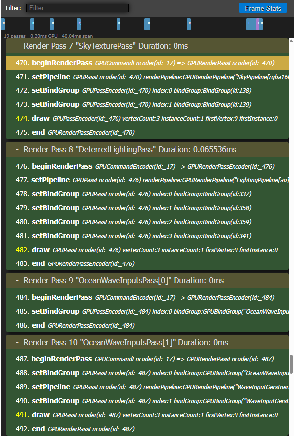
</a>

## Render Pass Textures
###### [Back to top](#capture)

The color and depth-stencil texture attachments of Render Passes will be captured and displayed in the capture panel.

Selecting a Render Pass image will select the associated beginRenderPass command.

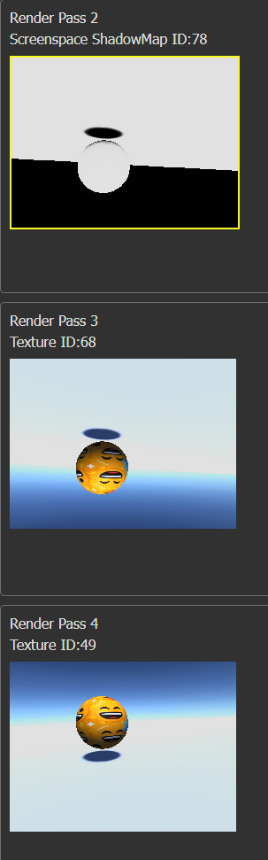

## Command Stacktrace
###### [Back to top](#capture)

When the **Stacktraces** capture option is enabled, each command records the stacktrace of where it was executed. The stacktrace is shown in the command's inspection panel. Stacktraces are off by default — see [Stacktraces](#stacktraces) under Capturing Frame Data.

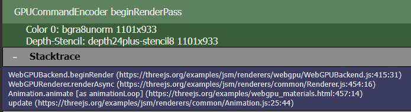

## Command Inspection
###### [Back to top](#capture)

Selecting a command will display information about the command, including its arguments and information about objects related to the command.

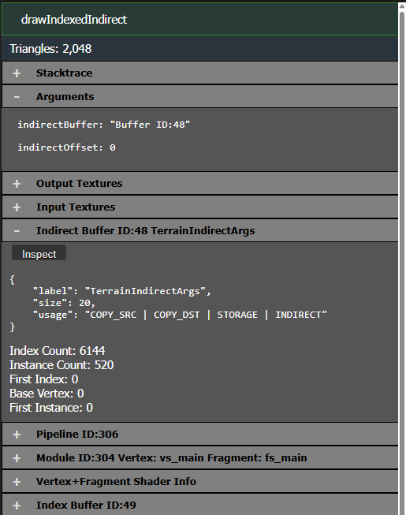

## Uniform and Storage Buffer Inspection
###### [Back to top](#capture)

If you select a Draw or Dispatch command, it will inspect the BindGroups and Pipeline active for the command. It will inspect the Buffer objects associated with the BindGroups, and parse their data based on the shaders associated the the Pipeline. This lets you inspect buffer data as the shader will see it during the Draw or Dispatch command.

**Affected By** lists the commands that have written to this particular buffer.

**Format** lets you customize the format of the buffer data. See [Formatting Buffer Data](formatting_buffer_data.md) for more information.

<a href="images/buffer_data_inspection.png">
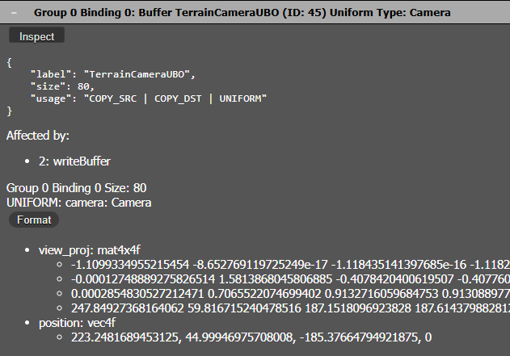
</a>

### Array Data

Array data can be quite large. To improve performance and readability, if the array has more than 100 elements, only a subset of array data is viewed. 

**Offset** is the starting index of the array to view.

**Count** is the number of elements of the array to view.

<a href="images/buffer_array_inspection.png">
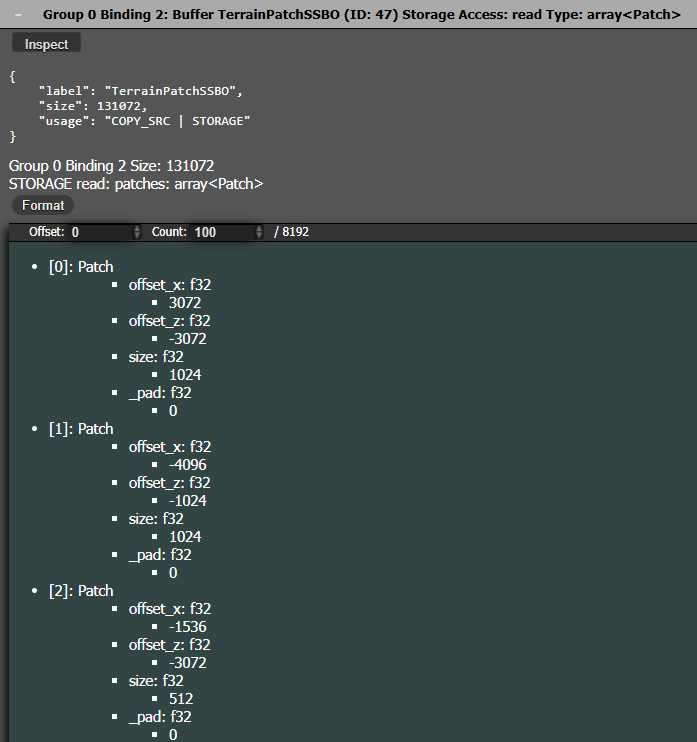
</a>

## Vertex Buffer Data
###### [Back to top](#capture)

If you select a Draw command, it will inspect any Vertex Buffers bound for the draw call. It will parse the data from the RenderPipeline descriptor, and the shader, to present the data as the shader will see it.

<a href="images/vertex_buffer_capture.png">
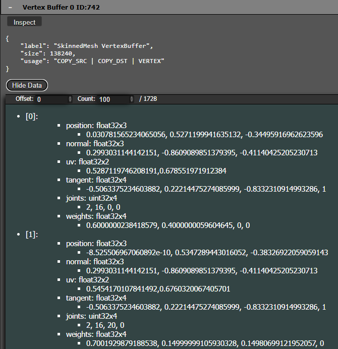
</a>

## Debug Groups
###### [Back to top](#capture)

If the page pushes/pops Debug Groups, they will be used to group commands in the capture. This is useful for organizing rendering commands to make it easier to identify what the commands are contributing to the render.

<a href="images/capture_debug_groups.png">
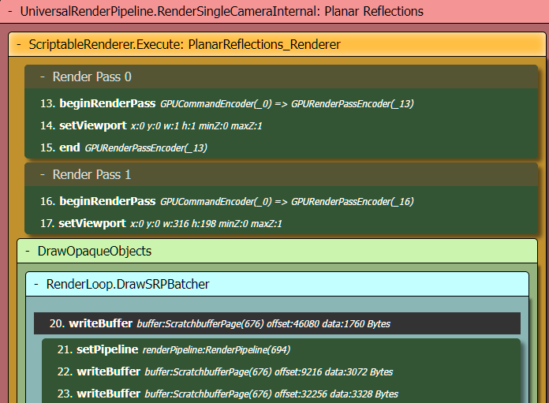
</a>

## Frame Stats
###### [Back to top](#capture)

The Capture tool can provide various statistics about the capture. Press the **Frame Stats** to show the capture statistics. These include how many graphics commands were called; how many draw calls; and so on. When [Profile Passes](#profile-passes) is enabled, Frame Stats also includes a **Pass Timings** breakdown of per-pass GPU duration.

<a href="images/capture_frame_stats.png">
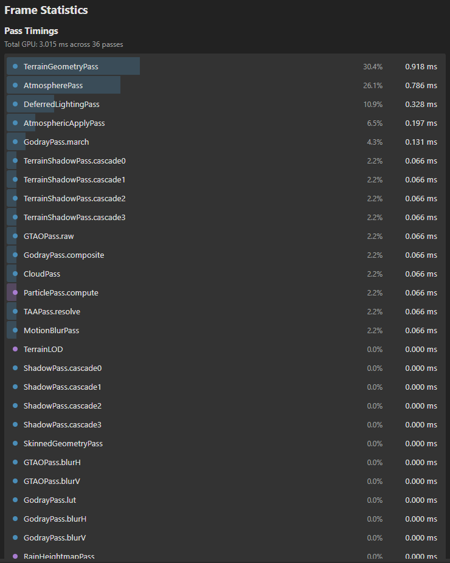
</a>

## Shader Debugger
###### [Back to top](#capture)

Frame captures include the ability to debug shaders. This is an experimental feature, with only compute shaders currently supported.

**[Shader Debugger](shader_debugger.md)**

<a href="shader_debugger.md">
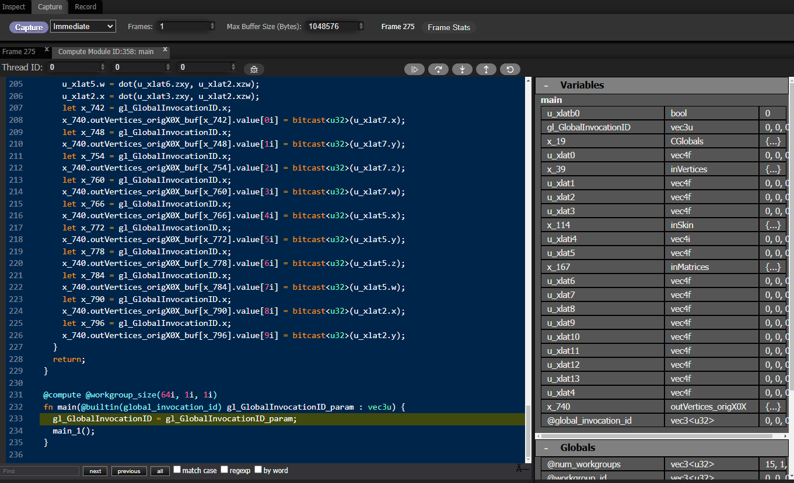
</a>
