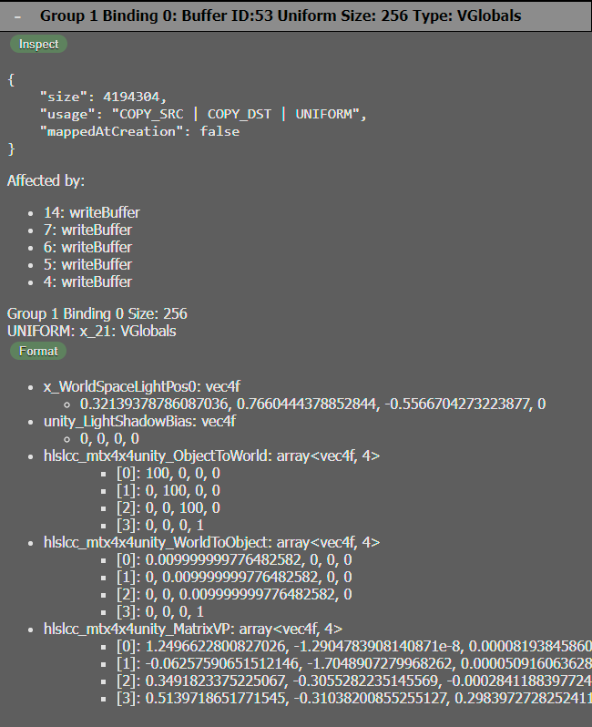

[Overview](overview.md) . [Inspect](inspect.md) . [Record](record.md)

# Capture

Capture all rendering commands used to render a frame, letting you inspect each command, as well as providing information about the rendering state at each command. It also captures the image results of each render pass.

## Render Pass Textures

The color texture attachments of Render Passes will be captured and displayed in the capture panel.

Selecting a Render Pass image will select the associated beginRenderPass command.

## Command Stacktrace

Each command will record the stacktrace of where it was executed.

## Command Inspection

Selecting a command will display information about the command, including its arguments and information about objects related to the command.

## Uniform and Storage Buffer Inspection

If you select a Draw or Dispatch command, it will inspect the BindGroups and Pipeline active for the command. It will inspect the Buffer objects associated with the BindGroups, and parse their data based on the shaders associated the the Pipeline. This lets you inspect buffer data as the shader will see it during the Draw or Dispatch command.

## Debug Groups

If the page pushes/pops Debug Groups, they will be be used to group commands in the capture.

## Frame Stats

The Capture tool can provide various statistics about the capture. Press the **Frame Stats** to show the capture statistics. These include how many graphics commands were called; how many draw calls; and so on.

