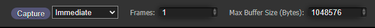

# Capture
[Overview](overview.md) . [Inspect](inspect.md) . [Record](record.md)

* [Introduction](#introduction)
* [Capturing Frame Data](#capturing-frame-data)
* [Frame Commands](#frame-commands)
* [Render Pass Textures](#render-pass-textures)
* [Command Stacktrace](#command-stacktrace)
* [Command Inspection](#command-inspection)
* [Uniform and Storage Buffer Inspection](#uniform-and-storage-buffer-inspection)
* [Frame Stats](#frame-stats)

----

* [Formatting Buffer Data](formatting_buffer_data.md)

## Introduction
###### [Back to top](#capture)

Capture all rendering commands used to render a frame, letting you inspect each command, as well as providing information about the rendering state at each command. It also captures the image results of each render pass.

#### Note

Your rendering loop needs be using requestAnimationFrame for Capture to work, as Capture uses that to identify what commands to capture for a frame.

## Capturing Frame Data
###### [Back to top](#capture)

Press the **Capture** button to capture a frame from the page.

#### Max Buffer Size

The **Max Buffer Size** value specifies the maximum buffer size Capture will record, for Uniform and Storage buffers. Sending buffer data to the DevTools panel can be slow, so limiting the buffer size can help capture performance. Large buffers are typically used for storage buffers.

## Frame Commands
###### [Back to top](#capture)

Capture will record all GPU commands issued during a frame, including their arguments, and the stackrace of where it was called.

Selecting a command will display information about the command, including associated GPU objects.

## Render Pass Textures

The color texture attachments of Render Passes will be captured and displayed in the capture panel.

Selecting a Render Pass image will select the associated beginRenderPass command.

## Command Stacktrace
###### [Back to top](#capture)

Each command will record the stacktrace of where it was executed.

## Command Inspection
###### [Back to top](#capture)

Selecting a command will display information about the command, including its arguments and information about objects related to the command.

## Uniform and Storage Buffer Inspection
###### [Back to top](#capture)

If you select a Draw or Dispatch command, it will inspect the BindGroups and Pipeline active for the command. It will inspect the Buffer objects associated with the BindGroups, and parse their data based on the shaders associated the the Pipeline. This lets you inspect buffer data as the shader will see it during the Draw or Dispatch command.

**Affected By** lists the commands that have written to this particular buffer.

**Format** lets you customize the format of the buffer data. See [Formatting Buffer Data](formatting_buffer_data.md) for more information.

## Debug Groups

If the page pushes/pops Debug Groups, they will be be used to group commands in the capture.

## Frame Stats
###### [Back to top](#capture)

The Capture tool can provide various statistics about the capture. Press the **Frame Stats** to show the capture statistics. These include how many graphics commands were called; how many draw calls; and so on.

