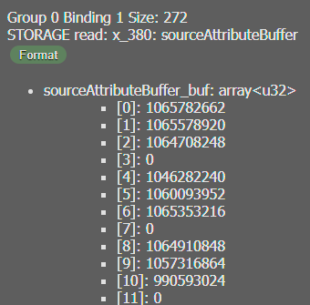
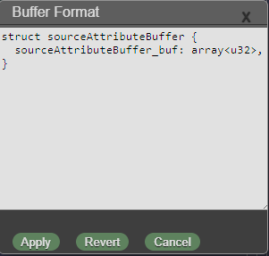
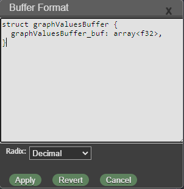
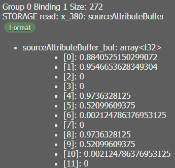
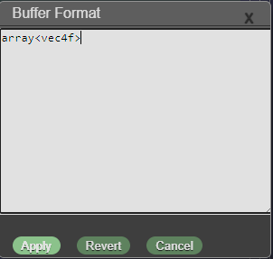
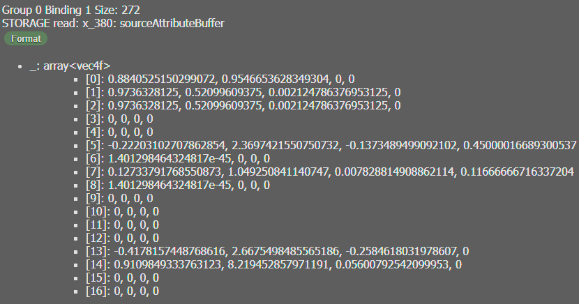
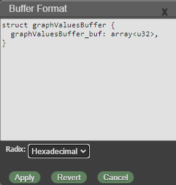
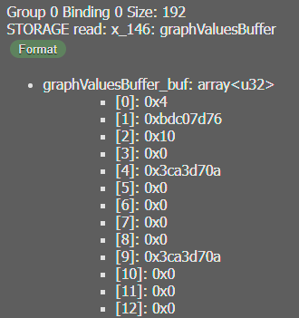

[Overview](../README.md) . [Inspect](inspect.md) . [Capture](capture.md) . [Record](record.md)

# Formatting Buffer Data

###### [Back to capture](capture.md/#uniform-and-storage-buffer-inspection)

By default WebGPU Inspector will present the data of captured storage and uniform buffers based on parsed reflection information from the shader bound to the render state of the draw or dispatch call. In some cases you may want to view this data differently. WebGPU Inspector lets you override the format the buffer data is viewed as.

Example:

The following storage buffer is defined as an array of unsigned int numbers in the shader. The shader bitcast's these numbers to floats. The Format tool can be used to change the view of this data from u32's to f32's, to see that float representation of these values.

Pressing the **Format** button will bring up the Buffer Format editor.

The buffer format is the WebGPU Shading Language type of the buffer variable. If you edit the format and press apply, it will parse the new format text and use the reflection information from that to interpret the buffer data.

In this case we could interpret the buffer as an array of floats instead of an array of unsigned ints. In this case, change the u32 to an f32.

The **Apply** button applies the changes you made to the view of the buffer.

**Revert** will remove any edits you made and view the buffer with the original type.

**Cancel** will close the editor without making any changes.

Applying the changes to the buffer format, the buffer data view will be updated with the new format.

You can change the format of the data in any way as long as it's a valid WGSL type. For example, we can view the data as an array of vec4f values.

Which would then present the buffer data as:

## Radix Views

Not only can you change the format of the data, you can change the number radix of the display, from **Decimal**, **Hexidecimal**, **Octal**, or **Binary**. Changing the Radix to Hexidecimal will display all numbers as hexidecimal.

## Format data types

Format types are specified as WGSL variable types. These can be either struct, array, or basic types. See the WGSL spec for more information.

### Basic Types

WGSL supprots the following basic types:
* i32 - signed 32-bit integer
* u32 - unsigned 32-bit integer
* f32 - 32-bit floating-point number
* f16 - 16-bit floating-point number
* bool - boolean
* atomic\<T> - an atomic basic type, interpreted as the basic type itself.

### Arrays

WGSL supports arrays of any type T, where T is a basic type, another array, or structure.

* array\<T, count> - fixed sized array of type T.
* array\<T> - runtime sized array of type T.

### Structures

WGSL supports structure types.

* struct name { member: T, ... }

For struct types, if the name of the struct in the format matches the name of the original type of the buffer, that struct will be used. Otherwise, the last struct defined in the format will be used.

For non-struct types, due to how the reflection information works, these types will be automatically wrapped in a struct.

For example, the format `array<f32>` will be automatically wrapped in a struct `struct _array { _: array<f32> }`.

