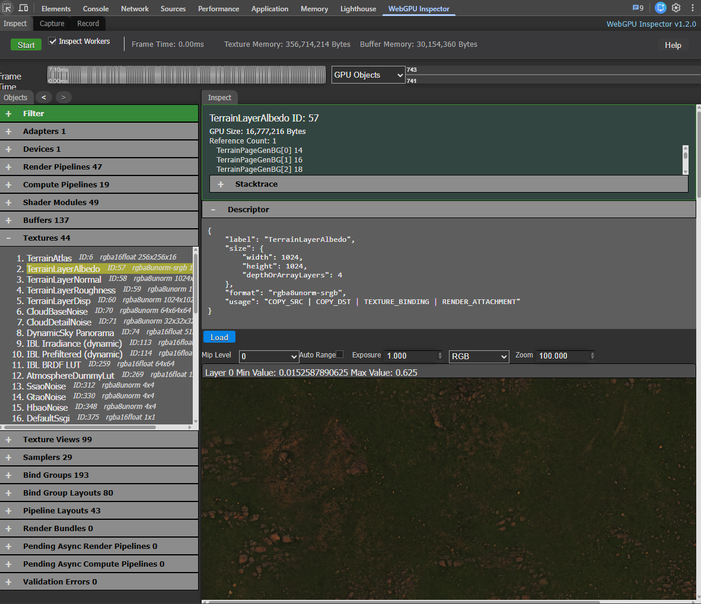
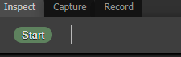
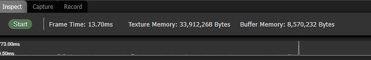
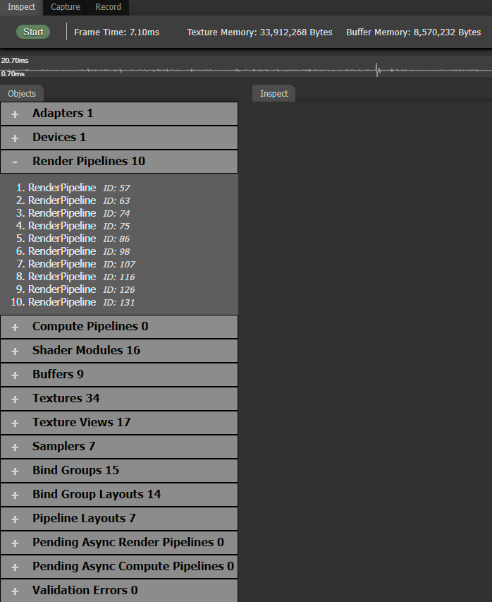
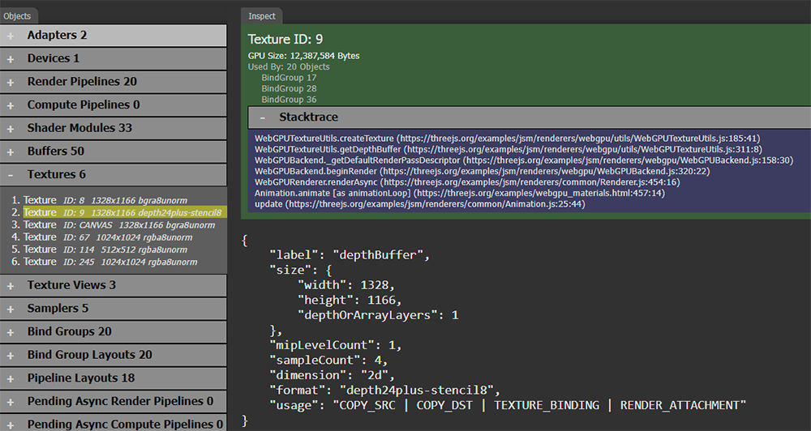
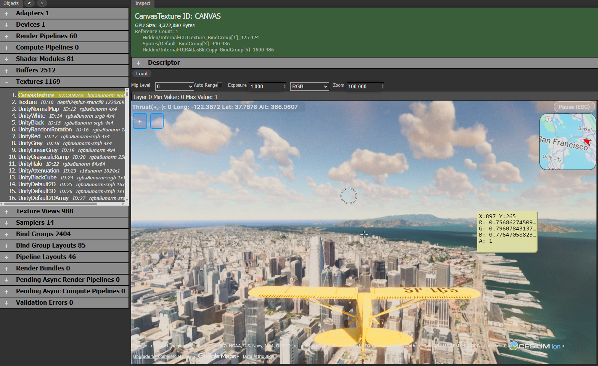
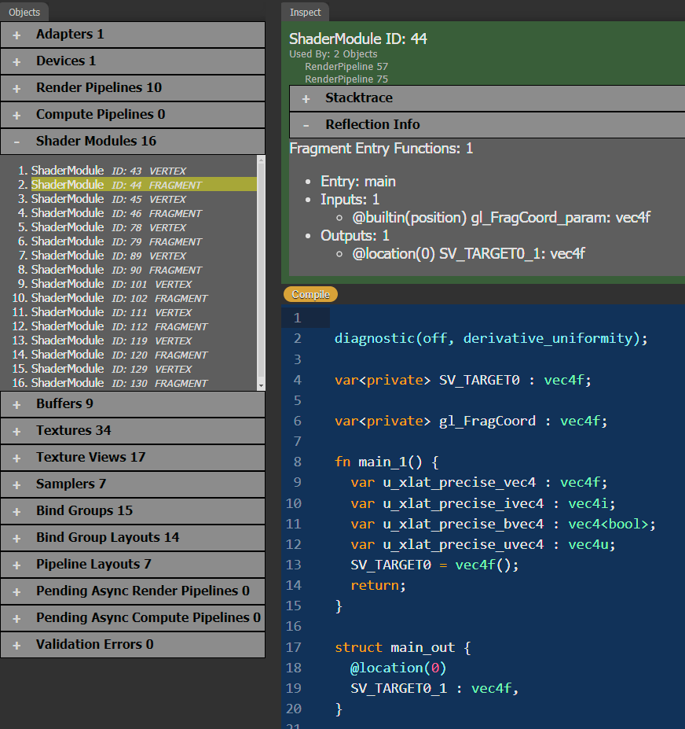

# Inspect

[Overview](../README.md) . [Capture](capture.md) . [Record](record.md)

* [Introduction](#introduction)
* [Starting the Inspect Tool](#starting-the-inspect-tool)
* [GPU Stats](#gpu-stats)
* [GPU Objects](#gpu-objects)
* [Inspection History](#inspection-history)
* [Filters](#filters)
* [Object Stacktrace](#object-stacktrace)
* [Validation Errors](#validation-errors)
* [Textures](#textures)
* [Shaders](#shaders)
* [Editing Shaders](#editing-shaders)
* [Profiling Tips](#profiling-tips)

## Introduction
###### [Back to top](#inspect)

The Inspect tool shows you a real-time view of all WebGPU Objects that have been created by the page. As objects are created and destroyed, they are reflected by the Inspect tool.

## Starting the Inspect Tool
###### [Back to top](#inspect)

WebGPU Inspector does not interfere with a page by default, so you must start the tool for the information to be reported.

Press the **Start** button on the Inspect panel. This will **reload** the page, injecting the inspector script. The inspector will intercept all WebGPU commands and report data back to the inspector panel.

When the WebGPU Inspector is active on the page, there will be a small icon drawn on the upper-left corner of the page.

### Inspecting Web Workers

The **Inspect Workers** checkbox next to the **Start** button controls whether the inspector also instruments WebGPU calls made inside **Web Workers** the page creates.

It is **on by default**, so worker-side WebGPU objects and frames show up in the panel without any extra steps. Injecting into workers requires the inspector to wrap the worker's `Worker` constructor and rewrite worker URLs, which can interfere with some applications — if a page misbehaves only while being inspected, turn this off and press **Start** again. When disabled, the page's `Worker` constructor is left completely untouched.

The setting is remembered between DevTools sessions, and the Capture panel uses it too.

### Notes

* If you press the Start button and the page does not reload, manually refresh the page and press the Start button again. Sometimes the DevTools extension doesn't get injected into the page correctly.

* If you refresh the page, it will no longer have the injected inspector script. Press the Start button on the Inspector tool to start inspecting again.

* If you close the DevTools window and open it again, it will have lost the data it collected before. Press the Start button to re-start data collection.

## GPU Stats
###### [Back to top](#inspect)

The inspector will report basic statistics about what's going on with the page.

**Frame Time**: How long it took the last frame to render. This will be updated every frame.

**Texture Memory**: How much memory is currently being used for textures on the GPU.

**Buffer Memory**: How much memory is currently being used for buffers on the GPU.

### Meters

**Frame Time**: Plots the frame duration over time. This lets you identify spikes in your renders. A common source of spikes is garbage collection. The graph labels show you the minimum frame time and maximum frame time over the plotted frames.

**GPU Objects**: Plots the number of GPU Objects that are allocated over time. You can select a specific GPU object type to plot from the option box. The GPU Objects option tracks all GPU objects.

A plot that has a saw-tooth pattern indicates you are allocating GPU objects and garbage collection is destroying them. Some GPU objects are more expensive than others, such as buffers and textures. Others are light-weight, such as texture views. But with any garbage collected language, minimizing garbage collection is ideal.

## GPU Objects
###### [Back to top](#inspect)

WebGPU is an object based API, and has different object types.

Selecting an object will display information about the object in the Inspect tab. The categories
include Adapters, Devices, Render/Compute Pipelines, Shader Modules, Buffers, Textures, Texture
Views, Samplers, Bind Groups, Bind Group Layouts, Pipeline Layouts, Render Bundles, pending async
pipelines, and Validation Errors. Inspecting an Adapter shows its full set of features and limits.

Each object category displays how many objects of that type are allocated.

Objects that have an associated error are highlighted in red in the lists, and inspecting an object
includes an **Errors** section listing any errors reported for it (see [Validation Errors](#validation-errors)).

## Inspection History
###### [Back to top](#inspect)

The header of the GPU Objects list has **<** (Back) and **>** (Forward) buttons that step through the
objects you have inspected, like browser history navigation. This makes it easy to return to a
previously inspected object after following references — for example, jumping from a bind group to
one of its textures and back. The buttons are disabled when there is nothing to navigate to.

## Filters
###### [Back to top](#inspect)

Large applications can allocate hundreds or thousands of GPU objects, making it difficult to find the one you care about. The **Filter** panel at the top of the GPU Objects list lets you narrow the lists down by name, by type-specific properties, or to just the objects referenced by the most recent frame capture.

When a filter is active, each object category's header shows the number of visible objects over the total (for example, `Textures 12/184`). Clearing all filter fields restores the full lists.

### Search

A free-text **Search** field at the top of the Filter panel matches against every object's label, id, and class name. The match is case-insensitive and applies across all object categories simultaneously.

### Only objects used in last capture

The **Only objects used in last capture** checkbox hides every object that was not referenced by the most recent frame capture. This makes it easy to focus on the resources that participated in a specific frame after running a capture from the [Capture panel](capture.md). The list updates automatically when a new capture is taken or cleared.

### Textures / Views

* **Format**: substring match against the texture's format (for example, `rgba8unorm`, `depth`).
* **Width**, **Height**, **Depth**: numeric comparisons. Each field accepts a plain number for equality, or one of the operators `>`, `>=`, `<`, `<=`, `=` followed by a number (for example, `>=256`, `<1024`, `>1` for array layers).

The texture filters apply to both the Textures list and the Texture Views list (a view inherits its texture's dimensions and format).

### Buffers

* **Size**: numeric comparison against the buffer's size in bytes (for example, `>=1024`).
* **Usage**: checkboxes for `Index`, `Vertex`, `Uniform`, `Storage`, `Indirect`, and `QueryResolve`. A buffer matches if it has any of the selected usages.

### Shader Modules

The **Type** checkboxes (`Vertex`, `Fragment`, `Compute`) keep only shader modules that define an entry point of the selected stage. A module with multiple entry stages matches if any selected stage is present.

### Bind Groups

The **Contains** field matches a bind group if any of its bound resources (buffers, texture views, or the textures underlying those views) match the given name or id substring. This is useful for finding every bind group that uses a particular texture or buffer.

## Object Stacktrace
###### [Back to top](#inspect)

The stacktrace for each object is recorded, identifying where in the code the object was created.

## Validation Errors
###### [Back to top](#inspect)

The inspector listens for WebGPU validation errors and collects them in a **Validation Errors**
category at the bottom of the GPU Objects list. Selecting an error shows its message (and stacktrace
when available) along with a button that jumps to the GPU object that caused it. The object that an
error refers to is highlighted in red in the object lists.

The inspector also reports some common mistakes as validation errors:

* **Memory leaks** — a buffer, texture, or device that is garbage collected without being explicitly
  destroyed. These objects should be explicitly destroyed to avoid GPU memory leaks.
* **Expired canvas texture use** — using a canvas texture (or a bind group containing one) after it
  has expired, for example as a render pass attachment in a later frame.

## Textures
###### [Back to top](#inspect)

When you inspect a texture, a Load button pulls the texture image from the page for visualizing.

Mousing over the texture image will show the pixel color values, if the Inspector can decode the texture format.

The layer title bar will include the min and max pixel color values from the texture.

Left-click on the texture will show the pixel value on the texture layer title bar.

Mip Level: select the mip level to inspect.

Auto Range: when enabled, the min and max pixel values from the texture are used to normalize the texture display.

Exposure: adjusts the brightness of the texture's display.

Channel: lets you inspect specific color channels of the image.

Zoom: scale the display of the texture. You can also control the texture display zoom using **control+mouse-wheel**.

Depth textures are always normalized for display. This means the min and max
values of the texture are found, then all values in the depth texture
are normalized to that range. This makes it easier to visualize depth
textures, even if their values are in a compressed range. Other texture types can
be displayed normalized using the Auto Range setting.

**Note:** if the page is using WebGPU compatibility mode, depth textures can't be viewed as compatibility mode lacks the feature needed to read depth textures.

## Shaders
###### [Back to top](#inspect)

When you inspect a shader, it provides an editor for the shader's code.

### Reflection Info

WebGPU Inspector will parse the shader's WGSL code and provide reflection information about the shader. This includes the
entry functions, inputs and outputs, and resource binding information.

### Editing Shaders

You can make changes to the shader code and press the Compile button. The modified shader will be sent to the page and replace the original version of the shader, letting you immediately see shader changes live on the page.

#### Note

There are limitations to the types of changes you can make to the shader. The page already has a pipeline and bind groups for the original version of the shader, so making any changes to the bindings used by the modified version of the shader will likely result in WebGPU errors.

## Profiling Tips
###### [Back to top](#inspect)

For per-pass GPU timing, the [Capture panel](capture.md) has a **Profile Passes** option that injects
timestamp queries around render and compute passes and presents the results as a timeline, showing
what percentage of the frame each pass takes. The Inspect panel's stats can also reveal some
opportunities for optimization:

* Periodic spikes in the frame time graph indicate your page is probably doing garbage collection during those frames. Try to minimize JavaScript's garbage collection by caching and re-using GPU objects as much as possible.
* Object numbers rising and falling over time indicate the page is allocating and destroying objects frequently. If the objects accumulate quickly and go down gradually, it indicates you are creating objects and relying on garbage collection to destroy them.
    * Buffer and texture objects in particular are expensive to create and destroy, so you should try to cache buffers and textures in particular as much as possible. Other types of objects, like Texture Views, may be inexpensive but can still cause garbage collection stalls.
