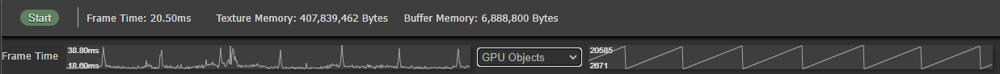

# Inspect

The Inspect tool shows you a real-time view of all WebGPU Objects that have been created by the page. As objects are created and destroyed, they are reflected by the Inspect tool.

## Starting the Inspect Tool

WebGPU Inspector does not interfer with a page by default, so you must start the tool for the information to be reported.

Press the Start button on the Inspect panel. This will **reload** the page, injecting the inspector script. The inspector will intercept all WebGPU commands and report data back to the inspector panel.

If the page is refreshed, it will no longer have the injected inspector script. Press the Start button on the Inspector tool to start inspecting again.

If you close the DevTools window and open it again, it will have lost the data it collected before. Press the Start button to re-start data collection.

## GPU Stats

The inspector will report basic statistics about what's going on with the page.

**Frame Time**: How long it took the last frame to render. This will be updated every frame.

**Texture Memory**: How much memory is currently being used for textures on the GPU.

**Buffer Memory**: How much memory is currently being used for buffers on the GPU.

**Frame Time Graph**: The graph plots the frame duration over time. This lets you identify spikes in your renders. A common source of spikes is garbage collection. The graph labels show you the minimum frame time and maximum frame time over the plotted frames.

## GPU Objects

WebGPU is an object based API, and has different object types.

Selecting an object will display information about the object in the Inspect tab.

Each object category displays how many objects of that type are allocated.

### Adapters

An Adapter is the root object for WebGPU. It provides information about the GPU, and is used to create a Device.

### Devices

Devices are the main object for accessing the GPU by creating objects.

### Render Pipelines

### Compute Pipelines

### Shader Modules

### Buffers

### Textures

### Texture Views

### Samplers

### Bind Groups

### Bind Group Layouts

### Pipeline Layouts

### Pending Async Render Pipelines

### Pending Async Compute Pipelines

### Validation Errors
