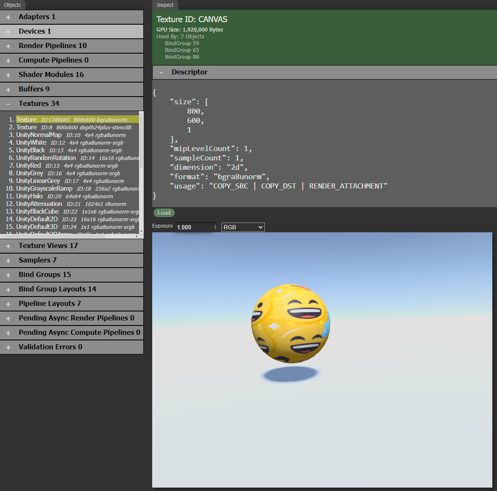

[Overview](overview.md) . [Capture](capture.md) . [Record](record.md)

* [Starting the Inspect Tool](#starting-the-inspect-tool)
* [GPU Stats](#gpu-stats)
* [GPU Objects](#gpu-objects)
* [Object Stacktrace](#object-stacktrace)
* [Textures](#textures)
* [Shaders](#shaders)
* [Editing Shaders](#editing-shaders)
* [Profiling Tips](#profiling-tips)

# Inspect

The Inspect tool shows you a real-time view of all WebGPU Objects that have been created by the page. As objects are created and destroyed, they are reflected by the Inspect tool.

## Starting the Inspect Tool

WebGPU Inspector does not interfere with a page by default, so you must start the tool for the information to be reported.

Press the **Start** button on the Inspect panel. This will **reload** the page, injecting the inspector script. The inspector will intercept all WebGPU commands and report data back to the inspector panel.

When the WebGPU Inspector is active on the page, there will be a small icon drawn on the upper-left corner of the page.

### Notes

* If you press the Start button and the page does not reload, manually refresh the page and press the Start button again. Sometimes the DevTools extension doesn't get injected into the page correctly.

* If you refresh the page, it will no longer have the injected inspector script. Press the Start button on the Inspector tool to start inspecting again.

* If you close the DevTools window and open it again, it will have lost the data it collected before. Press the Start button to re-start data collection.

## GPU Stats

The inspector will report basic statistics about what's going on with the page.

**Frame Time**: How long it took the last frame to render. This will be updated every frame.

**Texture Memory**: How much memory is currently being used for textures on the GPU.

**Buffer Memory**: How much memory is currently being used for buffers on the GPU.

### Meters

**Frame Time**: Plots the frame duration over time. This lets you identify spikes in your renders. A common source of spikes is garbage collection. The graph labels show you the minimum frame time and maximum frame time over the plotted frames.

**GPU Objects**: Plots the number of GPU Objects that are allocated over time. You can select a specific GPU object type to plot from the option box. The GPU Objects option tracks all GPU objects.

A plot that has a saw-tooth pattern indicates you are allocating GPU objects and garbage collection is destroying them. Some GPU objects are more expensive than others, such as buffers and textures. Others are light-weight, such as texture views. But with any garbage collected language, minimizing garbage collection is ideal.

## GPU Objects

WebGPU is an object based API, and has different object types.

Selecting an object will display information about the object in the Inspect tab.

Each object category displays how many objects of that type are allocated.

## Object Stacktrace

The stacktrace for each object is recorded, identifying where in the code the object was created.

## Textures

When you inspect a texture, a Load button pulls the texture image from the page for visualizing.

Mousing over the texture image will show the pixel color vlaues, if the Inspector can decode the texture format.

An Exposure control lets you adjust the brightness of the texture's display.
A Channel control lets you inspect specific color channels of the image.

## Shaders

When you inspect a shader, it provides an editor for the shader's code.

### Reflection Info

WebGPU Inspector will parse the shader's WGSL code and provide reflection information about the shader. This includes the
entry functions, inputs and outputs, and resource binding information.

### Editing Shaders

You can make changes to the shader code and press the Compile button. The modified shader will be sent to the page and replace the original version of the shader, letting you immediately see shader changes live on the page.

#### Note

There are limitations to the types of changes you can make to the shader. The page already has a pipeline and bind groups for the original version of the shader, so making any changes to the bindings used by the modified version of the shader will likely result in WebGPU errors.

## Profiling Tips

Profiling tools have not been added yet, but the Inspector can reveal some oportunities for optimizations.

* Periodic spikes in the frame time graph indicate your page is probably doing garbage collection during those frames. Try to minimize Javascripts garbage collection by caching and re-using GPU objects as much as possible.
* Object numbers rising and falling over time indicate the page is allocating and destroying objects frequently. If the objects accumilate quickly and go down gradually, it indicates you are creating objects and relying on garbage collection to destroy them.
    * Buffer and texture objects in particular are expensive to create and destroy, so you should try to cache buffers and textures in particular as much as possible. Other types of objects, like Texture Views, may be inexpensive but can still cause garbage collection stalls.
