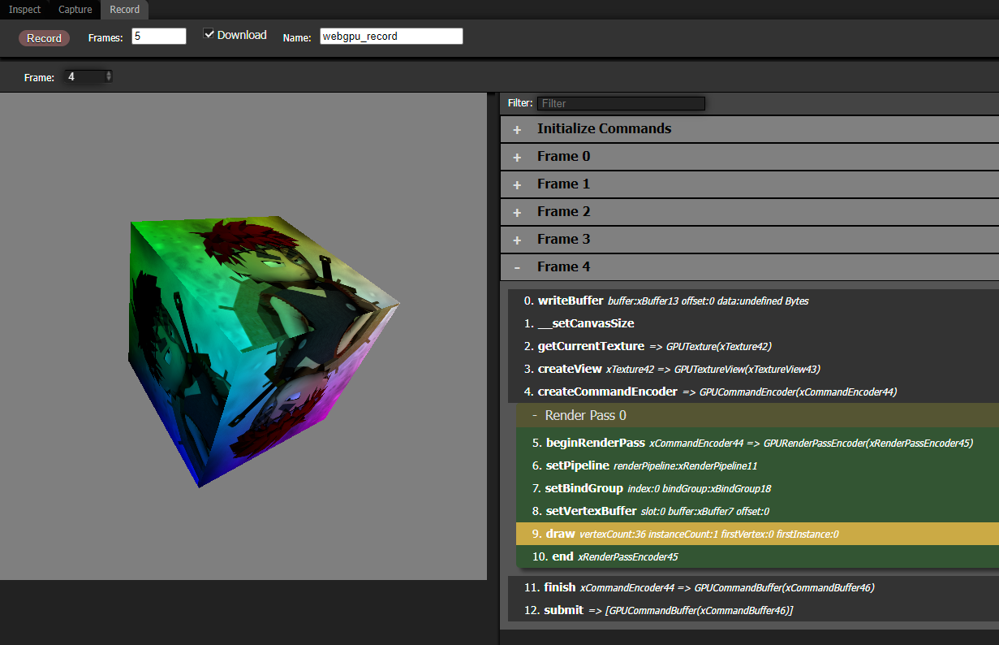

# WebGPU Inspector

WebGPU Inspector is a Developer Tools extension for debugging WebGPU content.

It includes multiple tools for graphical debugging.

## [Inspect](inspect.md)

[Inspect](inspect.md) reports all GPU objects that have been created and lets you inspect information about them, and in some cases edit them.

## [Capture](capture.md)

[Capture](capture.md) records all WebGPU commands used to render a frame and generates a report, letting you inspect each command, including rendering state and the image results of each render pass.

## [Record](record.md)

[Record](record.md) records all WebGPU commands and their associated data, generating an HTML file with inlined Javascript that recreates the rendered frames. This lets you open the recording file in a browser to replay the render, and edit the javascript to test out changes independently of the engine used to create the render. It can also be used to create reproduction test cases for bug reports, to isolate the graphics issue separate from the engine.

