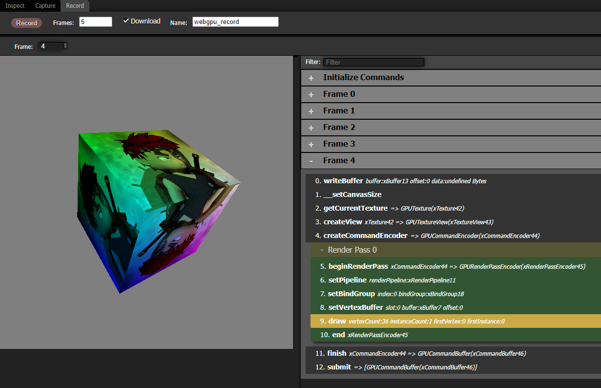

[Overview](../README.md) . [Inspect](inspect.md) . [Capture](capture.md)

# Record

Records all rendering commands and associated data, generating a self-contained HTML file with Javascript that recreates the render.

In order to be able to recreate the render, it needs to record all commands and data from the start of the app. This differs from the Capture tool, which can record any frame for inspecting, but doesn't have enough information to re-create a render.

## Options

**Frames**: The number of frames to record. The Recorder uses requestAnimationFrame to determine what a frame is. It currently doesn't work with apps that don't use requestAnimationFrame.

**Download**: If checked, the Recorder will generate an html file with self contained javascript code to re-create the render. All buffer and texture data is embedded into the Javasript.

**Name**: The filename to use for the downloaded html, as \<Name\>.html.

## Downloaded HTML Recording File

IF Download option is checked, the Recorder will download an HTML file with embedded javascript and resource data. This recreates rendered frame(s) without any engine code, and is useful for submitting isolated bug reproductions, and render debugging. You can open the recording HTML in a browser, edit the Javascript, and diagnose problems or experiment with the rendering code outside of your engine.

## Recording Command List

The Recorder will also present the captured commands for each frame in the UI, and the resulting render. Selecting a command from the panel will execute all of the recorded commands up to the selected command. This lets you see the render at any stage of the frame.
