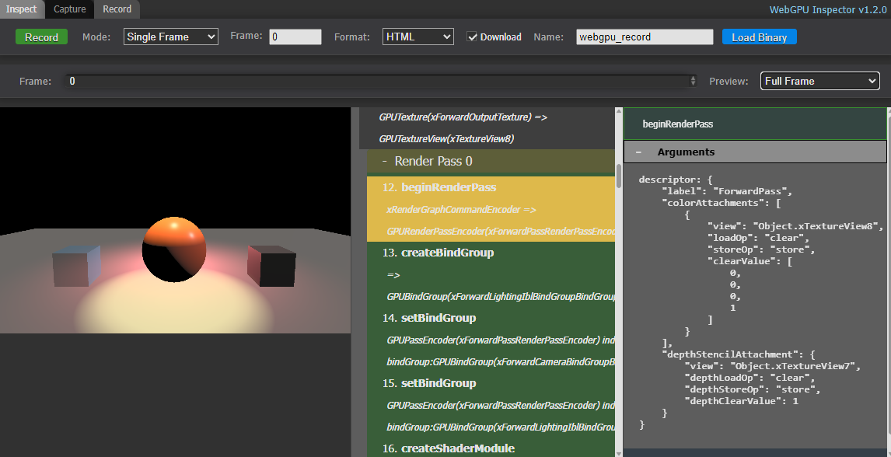

[Overview](../README.md) . [Inspect](inspect.md) . [Capture](capture.md)

# Record

Records all WebGPU commands and associated data needed to recreate a render, and can play the
recording back inside the panel or export it to a self-contained file.

Unlike the Capture tool — which inspects any single frame but doesn't capture enough information to
re-create a render — the Recorder tracks the WebGPU objects and data required to reproduce the
rendering on its own. The Recorder uses `requestAnimationFrame` to delimit frames, so it currently
does not work with apps that don't render via `requestAnimationFrame`. Frame indices refer to the
absolute `requestAnimationFrame` count since the page loaded.

Starting a recording reloads the page so the Recorder can wrap WebGPU before any rendering begins.

## Recording Modes

The **Mode** dropdown selects which frame(s) to capture:

- **Single Frame** (default): Capture one frame by its absolute frame index, entered in the **Frame**
  field.
- **Frame Range**: Capture a contiguous range of frames, from **Start** to **End** (inclusive). Each
  frame is written as its own recording, so a range produces one file per frame.
- **Multi-Frame**: Capture an explicit list of frames, entered as comma-separated indices (e.g.
  `5,10`). As with Frame Range, each captured frame is written as its own recording.
- **On Demand**: Don't capture a preset frame. The page runs normally with the Recorder tracking
  state, and a **Capture Frame** button captures whichever frame comes next when clicked. Enable
  **Continuous** to keep tracking after a capture so you can capture more frames in the same
  session; otherwise recording stops after the first captured frame.

## Output Format

The **Format** dropdown selects what the recording is exported as:

- **HTML**: A self-contained `.html` file with embedded JavaScript and resource data that recreates
  the render with no engine code. Open it in a browser to play it back, edit the JavaScript, and
  diagnose or experiment with the rendering outside of your engine. Useful for isolated bug
  reproductions and render debugging.
- **Binary**: A compact `.wgpu` file that stores the raw buffer/texture data without the base64
  inflation of the HTML format, producing much smaller files for large recordings. Binary recordings
  are loaded back into the Record panel (see **Load Binary** below) or played with `webgpu_player.js`.
- **Both**: Export both the HTML and binary files.

When recording HTML (or Both), the commands are also streamed into the panel for live playback. A
Binary-only recording is not streamed to the panel; load the saved `.wgpu` file to view it.

## Options

- **Mode**: The recording mode (see above), with its mode-specific inputs (Frame / Start+End /
  Frames / Continuous).
- **Format**: The output format (HTML, Binary, or Both).
- **Download**: If checked, the generated recording file(s) are downloaded automatically.
- **Name**: The base filename for the downloaded recording, used as `<Name>.html` and/or
  `<Name>.wgpu`.
- **Record**: Starts a recording with the selected options (reloads the page).
- **Capture Frame**: (On Demand mode, after recording has started) Triggers capture of the next
  frame.
- **Menu** (the **&#9776;** button, left of **Record**): Save and load recordings from the panel:
  - **Save Binary**: Saves the recording currently loaded in the panel as a `.wgpu` file.
  - **Save HTML**: Saves the recording as a self-contained `.html` playback page.
  - **Load Binary**: Opens a `.wgpu` file and plays it back in the panel.

  **Save Binary** and **Save HTML** are enabled once a recording is loaded — whether captured live
  or loaded from a `.wgpu` file — so a recording can be saved without relying on the **Download**
  option, and a panel-loaded recording can be re-exported to either format.

## Downloaded Recording Files

If **Download** is checked, the Recorder downloads the recording in the selected format:

- The **HTML** file embeds the JavaScript and all buffer/texture data, and recreates the rendered
  frame(s) standalone.
- The **Binary** `.wgpu` file stores the commands and raw resource data compactly. It can be
  re-opened in the Record panel with **Load Binary**, or played with `webgpu_player.js`.

## Recording View

When a recording is ready — whether captured live or loaded from a `.wgpu` file — the panel shows
three columns:

- **Preview canvas** (left): The rendered result of the current preview.
- **Command list** (middle): The recorded commands, grouped by render/compute pass with pass labels
  and debug groups, with a **Filter** box to narrow the list.
- **Command details** (right): For the selected command, its method, a lightweight summary, the
  formatted arguments, and result.

A **Frame** input (defaults to the last frame) and a **Preview** mode select control what the canvas
shows:

- **Selected Command**: Replays the commands up to and including the selected command (closing its
  pass and submitting), so you can see the render at any stage of the frame.
- **Full Frame**: Replays the whole frame — the selected command's frame, or, when no command is
  selected, the frame chosen in the **Frame** input.

For multi-frame recordings, each recorded frame appears in the command list and can be previewed.
