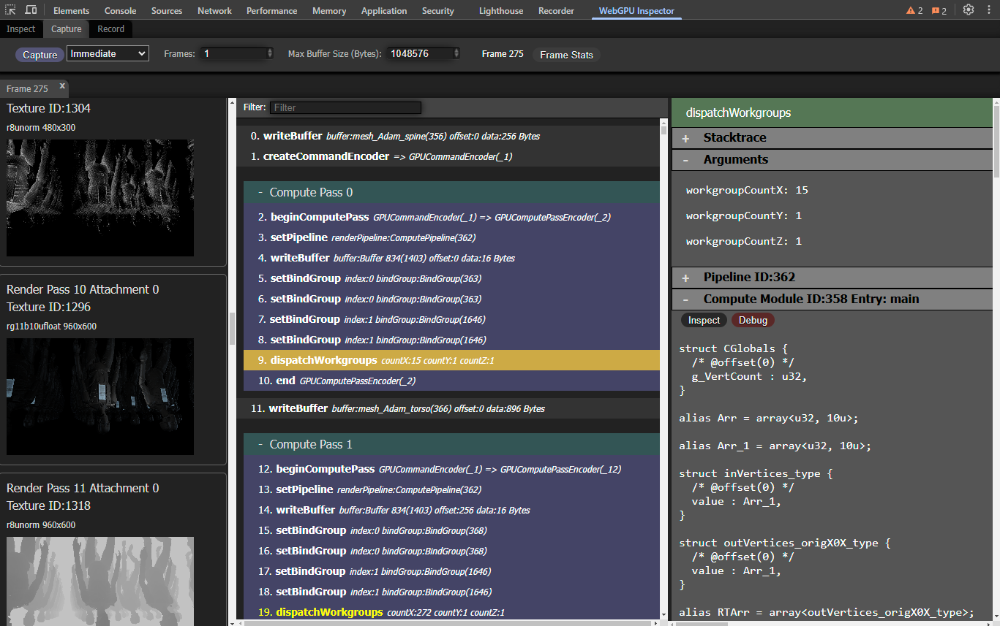
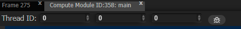
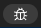
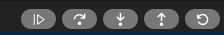
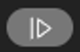
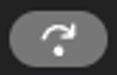
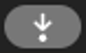
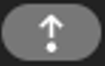
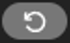

# Shader Debugger (Experimental)
[Overview](../README.md) . [Inspect](inspect.md) . [Capture](capture.md) . [Record](record.md)

## Introduction
###### [Back to top](#shader-debugger-experimental)

WebGPU Inspector lets you debug WGSL shaders, letting you step through shader code, set breakpoints, 
inspect variable values.

<b>Warning</b>

The shader debugger is an <b>experimental</b> work in progress and not guaranteed to work on all shaders. It supports <b>compute</b>, <b>vertex</b>, and <b>fragment</b> shaders.

The shader debugger is a CPU interpreter of WGSL shaders. Because it does not actually run on the GPU, there will be some differences in how the shader is executed compared to running on the GPU. The shader debugger steps through a single thread of execution of the shader, whereas on the GPU the shader is SIMD multithreaded. This means some shader behaviors, like workgroup shared memory and barrier functions, will not behave the same with the shader debugger. The shader debugger is not suitable for debugging issues that invove these things, or issues like race conditions. The shader debugger is best suited for debugging things like shader logic issues.

## Debugging a compute shader
###### [Back to top](#shader-debugger-experimental)

The shader debugger is integrated into the [Capture](capture.md) tool. Capturing a frame will capture all buffers and textures used to render the frame.

<b>Warning</b>

To properly debug the shader, all buffers and textures used by the shader will need to have been captured. Large buffers may have been skipped, due to the <b>Max Buffer Size</b> capture property. If a buffer was skipped due to being too large, increase the Max Buffer Size to accommodate for the size needed by the buffer and capture the frame again.

Select a **dispatchWorkgroups** command from the capture. The command details will include the **Compute Module** used with the dispatch. Open the Compute module section and there will be a **Debug** button. Press the Debug button to start debugging the shader. This will open a tab with the debugger for the selected shader dispatch.

## Debugging a vertex shader
###### [Back to top](#shader-debugger-experimental)

Select a **draw** or **drawIndexed** command from the capture. The command details include the render pipeline and its shader modules. Open the **Vertex Module** section (or the combined shader module section, if the pipeline uses a single module for both stages) and press the **Debug** / **Debug Vertex** button to start debugging the vertex shader for that draw. This opens a debugger tab for the selected vertex stage.

Instead of the compute **Thread ID**, the vertex debugger's toolbar provides a **Vertex** and an **Instance** input:

- **Vertex** is the `@builtin(vertex_index)` of the vertex you wish to debug.
- **Instance** is the `@builtin(instance_index)`.

When you start debugging, the inspector performs the "vertex fetch" that the GPU would normally do: it decodes the draw's captured vertex buffers according to the pipeline's vertex layout and feeds the resulting attribute values (plus the vertex/instance builtins) into the shader for the selected vertex. All vertex buffers used by the draw must have been captured for this to work; see the Max Buffer Size note above.

## Debugging a fragment shader
###### [Back to top](#shader-debugger-experimental)

Select a **draw** or **drawIndexed** command, open the **Fragment Module** section (or the combined shader module section), and press the **Debug** / **Debug Fragment** button. Fragment debugging works by picking a pixel in the draw's render target.

The fragment debugger's toolbar provides **Pixel X**, **Y**, and **Instance** inputs. Enter the pixel you want to debug and start debugging. The inspector then reproduces what the GPU rasterizer does:

1. It assembles the draw into triangles from the index/vertex buffers and topology.
2. It runs the vertex shader for the relevant vertices and rasterizes to find the triangle that covers the picked pixel.
3. It builds the four perspective-correct, interpolated inputs of the 2×2 pixel quad that contains the picked pixel, so that derivatives (`dpdx`/`dpdy`) and texture sampling resolve correctly.

You step through the picked pixel's lane; the other three lanes of the quad are advanced in lockstep at derivative and texture-sampling points. If no primitive in the draw covers the entered pixel, a message is shown in the toolbar (for example, `No primitive covers pixel (x, y)`) — pick a different pixel that lies inside the drawn geometry.

<b>Note</b>

Fragment debugging requires the draw's vertex buffers (and, for indexed draws, index buffer) to have been captured, since the inspector re-runs the vertex shader and rasterizes to locate the picked pixel.

## Debugger Controls
###### [Back to top](#shader-debugger-experimental)

### Invocation selection

The controls for choosing which shader invocation to debug depend on the shader
stage:

- **Compute** — a **Thread ID** (see below).
- **Vertex** — a **Vertex** (`vertex_index`) and **Instance** (`instance_index`) index.
- **Fragment** — a **Pixel X**, **Y**, and **Instance**.

#### Thread ID (compute)

The **Thread ID** is the **global_invocation_id** of the thread you wish to debug.
The **global_invocation_id** is based on the **dispatch workgroup_id** from the dispatch 
workgroup counts, and the local_invocation_id from the **workgroup_size** of the shader.

Enter the invocation you wish to debug (the Thread ID for compute, or the
Vertex/Instance or Pixel for vertex/fragment) and press the  button to start debugging
that invocation.  Keyboard shortcut: **F8**

### Debugger Controls

The shader debugger will start paused on the first statement of the compute shader kernel.
The toolbar at the top gives controls for stepping through the shader.

 Run from the current position all the way through to the end,
or until a breakpoint has been reached. Pressing this button again will pause the execution. Keyboard shortcut: **F5**

 Execute the current statement, stepping over any function calls.  Keyboard shortcut: **F10**

 Execute the current statement, stepping into any function calls.  Keyboard shortcut: **F11**

 Run from the current position until the current block or function
has completed.  Keyboard shortcut: **F12**

 Restart debugging the shader from the beginning.  Keyboard shortcut: **F7**

<b>Note</b>

The highlighted statement indicates the next statement to be executed, not the statement that was just executed.

## Breakpoints
###### [Back to top](#shader-debugger-experimental)

Click in the gutter to the left of a line number in the shader editor to set a
breakpoint on that line; a red marker appears. Click the marker again to remove
the breakpoint. When you **Continue** (F5), the debugger runs until it reaches a
breakpoint or the end of the shader.

## Variables
###### [Back to top](#shader-debugger-experimental)

The **Variables** panel, on the right side of the debugger, shows every variable
in scope at the current statement, along with its type and value. Each function
call currently on the stack contributes its own group of variables.

Composite values — structs, arrays, vectors, and matrices — can be expanded to
inspect their members and elements. When stepping, any value that changed since
the previous step is highlighted.

The **Filter variables by name** field at the top of the panel narrows the list
to variables whose name matches the entered text.

## Callstack
###### [Back to top](#shader-debugger-experimental)

The **Callstack** panel lists the chain of function calls that led to the
current statement, with the source line of each frame. It updates as you step
into and out of functions.

## Race Detection
###### [Back to top](#shader-debugger-experimental)

Race detection is available for **compute** shaders only. The **Detect Races** button runs a data-race detector over the compute kernel. Unlike
stepping, which executes a single thread, the detector runs every invocation of a
workgroup in lockstep, parking each one when it reaches a barrier. The memory accesses
between barriers are cross-checked: if two invocations touch overlapping memory in the
same barrier phase and at least one is a write, that is a data race.

The results appear in the **Race Detection** panel. Each reported race describes the
buffer, the conflicting invocations and the source lines involved; clicking a race
jumps the editor to the relevant line. Barrier divergence issues (barriers that are not
reached uniformly by all invocations) are reported as well.

A data race usually means a `workgroupBarrier()` or `storageBarrier()` is missing
between the conflicting accesses.

<b>Note</b>

The race detector scans a single workgroup. It detects races <b>within</b> a workgroup, caused by missing barriers. Races between different workgroups on storage memory are not decidable, as WebGPU provides no cross-workgroup ordering guarantees.

