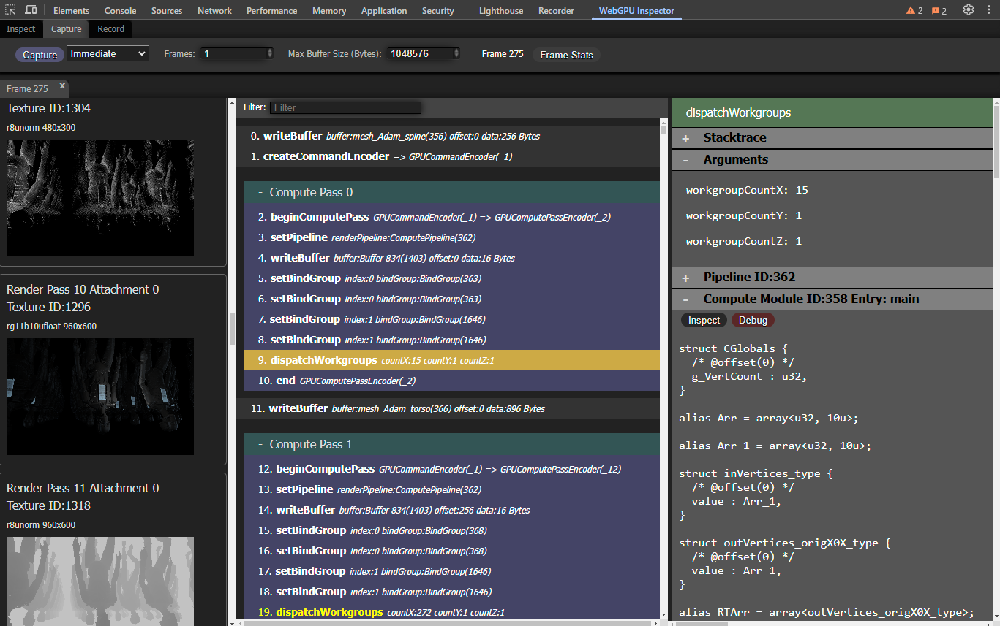

# Shader Debugging (Experimental)
[Overview](../README.md) . [Inspect](inspect.md) . [Capture](capture.md) . [Record](record.md)

## Introduction
###### [Back to top](#capture)

WebGPU Inspector lets you debug WGSL shaders, letting you step through shader code, set breakpoints, 
inspect variable values.

Warning

The shader debugger is a work in progress and not guaranteed to work on all shaders. It currently only supports <b>compute</b> shaders.

The shader debugger is a CPU interpreter of WGSL shaders. Because it does not actually run on the GPU, there will be some differences in how the shader is executed compared to running on the GPU. The shader debugger steps through a single thread of execution of the shader, whereas on the GPU the shader is SIMD multithreaded. This means some shader behaviors, like workgroup shared memory and barrier functions, will not behave the same with the shader debugger. The shader debugger is not suitable for debugging issues that invove these things, or issues like race conditions. The shader debugger is best suited for debugging things like shader logic issues.

## Debugging a shader
###### [Back to top](#capture)

The shader debugger is integrated into the [Capture](capture.md) tool. Capturing a frame will capture all buffers and textures used to render the frame.

Warning

To properly debug the shader, all buffers and textures used by the shader will need to have been captured. Large buffers may have been skipped, due to the <b>Max Buffer Size</b> capture property. If a buffer was skipped due to being too large, increase the Max Buffer Size to accomidate for the size needed by the buffer and capture the frame again.

Select a **dispatchWorkgroups** command from the capture. The command details will include the **Compute Module** used with the dispatch. Open the Compute module section and there will be a **Debug** button. Press the Debug button to start debugging the shader. This will open a tab with the debugger for the selected shader dispatch.

